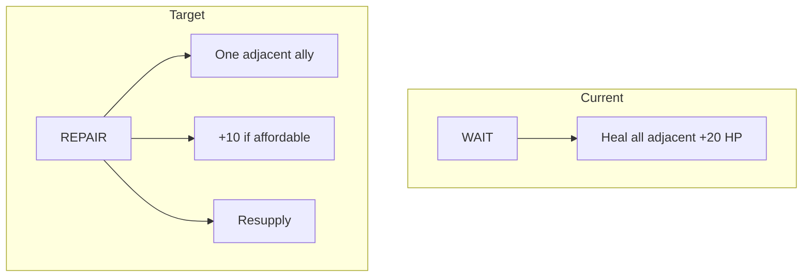

# AWBW engine parity — Black Boat and Pipe seams

Single plan merging former **Black Boat AWBW parity** and **Pipe seam verification** work. Execute when you leave plan mode and order implementation.

## Scope summary

| Area | AWBW expectation | Engine today |
|------|------------------|--------------|
| **Black Boat** | [Repair command](https://awbw.fandom.com/wiki/Black_Boat): 1 HP, 10% target cost (heal skipped if unaffordable), resupply still; one chosen adjacent ally | Repair on every WAIT, +20 HP (2 bars), no funds, all adjacent allies |
| **Pipe seams** | [99 HP](https://awbw.fandom.com/wiki/Pipes_and_Pipeseams), special damage (no luck), break → Broken Seam (Plains-like); Piperunner cannot use broken seam | Terrain IDs exist; `_apply_attack` exits when no unit on target — **cannot attack empty seam** |

## Part A — Black Boat

### Self-repair

[`_black_boat_repair`](c:\Users\phili\AWBW\engine\game.py) only scans orthogonal **neighbors**, so the boat is never `adj` in normal play. Still add **`if adj is boat: continue`** for defense-in-depth.

### Rules to implement

- **1 HP** → internal **`+10`** (not current `+20`).
- **10%** of target’s **listed** deployment cost; align rounding with AWBW.
- **Resupply** fuel/ammo even when heal is skipped or unaffordable (per wiki).
- **`REPAIR`** action with **`target_pos`**, not mass heal on **`WAIT`**.

### Files

[`engine/game.py`](c:\Users\phili\AWBW\engine\game.py), [`engine/action.py`](c:\Users\phili\AWBW\engine\action.py), [`tools/export_awbw_replay_actions.py`](c:\Users\phili\AWBW\tools\export_awbw_replay_actions.py), new/extended `test_*.py`.

---

## Part B — Pipe seams

### AWBW reference

- **99 HP** per seam; defense as **100/100 Neotank on 0★**; **no luck**; **CO + Comm Tower** bonuses apply.
- Broken tile = **Broken Seam** — **115 / 116** in [`terrain.py`](c:\Users\phili\AWBW\engine\terrain.py) (`HPipe Rubble` / `VPipe Rubble`), Plains-like; **Piperunners** cannot traverse broken seam (per wiki).

### Gap

[`_apply_attack`](c:\Users\phili\AWBW\engine\game.py) returns early when `get_unit_at(target_pos)` is **None**, so **empty seams cannot be struck**. No seam HP state; [`damage_table.json`](c:\Users\phili\AWBW\data\damage_table.json) has no seam column.

### Implementation direction

- Store **remaining seam HP** (or damage tally) for tiles 113/114.
- **Targetability (acceptance check):** Seams must be **selectable** like unit targets — the legal-action pipeline must not require `get_unit_at(target)` for seam tiles; today [`_apply_attack`](c:\Users\phili\AWBW\engine\game.py) bails when `defender is None` — fixing that is part of **seam-targetable-check** + **seam-attack-seam**.
- **Attack seam** path (or extend attack): apply seam damage formula, then if **≥ 99** damage accumulated, rewrite **`map_data.terrain[r][c]`** to **115** or **116** (preserve H vs V).
- Encode or import **per-unit-type base damage vs seam** from [wiki table](https://awbw.fandom.com/wiki/Pipes_and_Pipeseams).

### Files

Same core trio as Part A (`game.py`, `action.py`, export tools), plus [`engine/map_loader.py`](c:\Users\phili\AWBW\engine\map_loader.py) / `MapData` if seam state lives on the map, [`data/`](c:\Users\phili\AWBW\data) for seam damage data if not hardcoded.

---

## Part C — Replay **170901** (bugs)

Symptoms reported:

1. **Crash near turn ~29** — Advancing the replay toward **turn 29** (approximate; hard to pin down) causes the viewer to **close immediately** / crash.
2. **Turn load errors on open** — Opening the replay shows **issues opening a few turns** (error state for those turns).

**Constraints:** Treat as **export / trace / action-stream** correctness unless proven viewer-only. Cross-check upstream AWBW Replay Player sources on GitHub; we do not keep a vendored C# tree in-repo.

**Suggested workflow:** Locate `170901` artifact under [`replays/`](c:\Users\phili\AWBW\replays) or regenerate from trace; use [`tools/export_awbw_replay_actions.py`](c:\Users\phili\AWBW\tools\export_awbw_replay_actions.py) rebuild path and [`tools/compare_awbw_replays.py`](c:\Users\phili\AWBW\tools\compare_awbw_replays.py) / [`deep_diff_replays.py`](c:\Users\phili\AWBW\tools\deep_diff_replays.py) if a reference zip exists; bisect which turn’s envelope first fails deserialization or state rebuild.

---

## Shared concerns

- **`full_trace` / replay:** Both features need correct action types and snapshot consistency ([`awbw-replay-system` skill](c:\Users\phili\AWBW\.cursor\skills\awbw-replay-system\SKILL.md)).
- **Execution order:** Either sub-feature can be implemented first; both touch **`game.py`** `step` / attack terminators — coordinate merges to avoid conflicting branches. **Replay 170901** can be debugged in parallel once artifacts are in-tree.

When ready to **execute**, exit plan mode and implement against the **todos** in the YAML frontmatter above.
