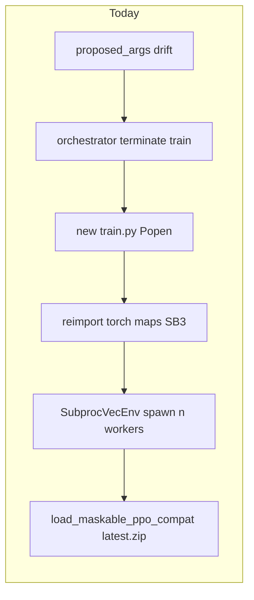
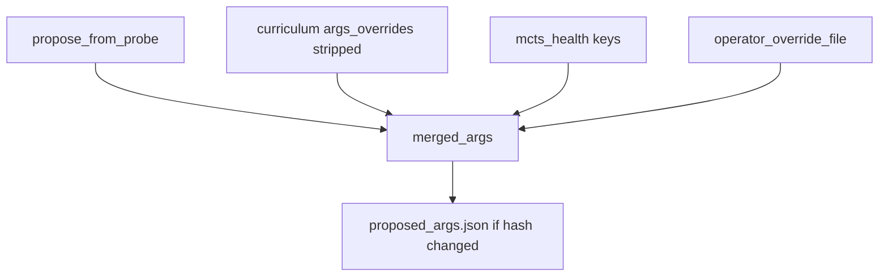

# Low-cost training argument changes

## Operator intention

- **Controllable parallelism per machine:** I want to **demand** a training arg for a specific PC — for example `--n-envs` **12** — for a period, using **one** obvious file or sidecar the orchestrator **reads** on refresh. When I **remove** that input, behavior should **revert** to the normal probe default for that machine (e.g. **4** on `pc-b` from [`PC_B_MAX_ENVS`](tools/propose_train_args.py)) without editing Python constants or re-fighting the tick loop every time `proposed_args.json` is regenerated.
- **No accidental fights:** I do not want probe + curriculum + MCTS merge to **clobber** or repeatedly **rewrite** my choices for probe-owned keys when I have stated an override; changes to `proposed` should be **intentional**, and hash drift / restarts should not come from “the refresh overwrote me again.”
- **Phased engineering priority:** Ship the **override file + clear merge order** first (highest value, lowest risk). Treat **in-process soft reconfigure** and **deferred restarts** as follow-ons that **reduce** full-process and reload cost when hard restarts or timing still hurt — not prerequisites for the control surface I care about.
- **Accept limits:** I accept that new worker processes and buffer geometry may still cost restarts or careful SB3 handling; the plan should **minimize** parent-process churn and duplicate bootstrap, not pretend `n_envs` changes are free.

---

## Current cost model (why it hurts)

- [`scripts/fleet_orchestrator.py`](scripts/fleet_orchestrator.py) `maybe_restart_train_for_proposed_args` **kills the whole** `train.py` tree and **respawns** from [`build_train_argv_from_proposed_args`](scripts/fleet_orchestrator.py) + updated [`train_launch_cmd.json`](fleet/pc-b/train_launch_cmd.json).
- [`refresh_proposed_train_args_documents`](scripts/fleet_orchestrator.py) **rebuilds** `proposed_args.json` from **`propose_from_probe`** (for `pc-b`, [`PC_B_MAX_ENVS = 4`](tools/propose_train_args.py)) + curriculum, which **clobbers** operator intent and often **triggers** unnecessary hash drift / restarts.

**Reality:** Some parameters (e.g. `--n-envs`, `--n-steps`, `--batch-size`) **require** a new **rollout buffer** and usually a new **VecEnv** worker set. You cannot change those **inside** the same `SubprocVecEnv` without closing workers. The win is **avoiding** a **new OS process** (`python train.py`) and **re-loading** the **entire** stack from scratch if the same long-lived process can swap env + policy buffer in place (SB3-style `set_env` / recreate buffer) while **keeping weights in RAM**.

---

## Phase 1 — Stop paying for args you did not mean to change (config + orchestrator)

**Goal:** Fewer surprise restarts and less file churn; `proposed` reflects **durable** operator choices for probe-owned keys.

**Additional goal — demand overrides with automatic reversion:** The operator can place **overrides in a file** that `refresh` / `propose_from_probe` (or a thin helper they call) **reads every tick**. While the file **exists**, specified keys (e.g. `--n-envs: 12` for this PC) **win** over the probe/cap line (e.g. `PC_B_MAX_ENVS` → 4). When the operator **deletes the file** (or removes the key, if the schema is “keyed overrides only”), those keys are **no longer** supplied and behavior **reverts** to the normal probe + curriculum result — e.g. back to **4** `n-envs` on `pc-b` without editing Python constants. This is the clean “I demand 12 for a while, then I remove the demand” workflow; it should be **one documented path** (filename, JSON shape, precedence vs `proposed` merge and `operator_args` locks).

1. **Merge policy in** `refresh_proposed_train_args_documents` **(orchestrator):** After building `merged_args` from probe + curriculum, **merge in** keys from the **existing** `proposed_args.json` on disk for **`PROBE_OWNED_KEYS`** (already defined in [`tools/curriculum_advisor.py`](tools/curriculum_advisor.py): `--n-envs`, `--n-steps`, `--batch-size`) **only when** the operator has set an optional **“lock”** or when a new field like `operator_args` / `args_override` is present. Minimal alternative: **extend** [`propose_from_probe`](tools/propose_train_args.py) to read **optional** `fleet/<id>/operator_train_cap.json` (or env `AWBW_PC_B_MAX_ENVS`) so **16** is not forced back to **4** every tick without editing Python constants. The **per-PC override file** in the additional goal should sit in this merge order at **high precedence** (after probe+curriculum base, before or with documented interaction vs locks) so a temporary `--n-envs` demand is unambiguous.

2. **Document** that `applied_args.json` must stay hash-aligned with `proposed` if you want **no** auto-restart on the next tick (existing `args_content_sha256` contract).

**Outcome:** Changing args on disk becomes **intentional**; fewer **full** `train.py` kills from **curriculum/probe** alone.

---

## Phase 2 — Cheaper apply: defer or batch orchestrator-driven restarts

**Goal:** When a restart **is** required, avoid double work and allow a **single** reload at a controlled time.

1. **Optional flag** on [`fleet_orchestrator.py`](scripts/fleet_orchestrator.py): `--train-restart-deferred` or write `fleet/<id>/pending_train_restart.json` instead of immediate terminate when hash drifts; **train** (see Phase 3) **honors** pending restart at end of current `model.learn` chunk or after N steps.

2. **Cooldown / coalescing** already exist (`apply_cooldown_s`); extend with **“max one restart per tick per machine”** and log when a restart is **skipped** due to pending apply (clearer [`logs/fleet_orchestrator.jsonl`](logs/fleet_orchestrator.jsonl)).

**Outcome:** Fewer overlapping kill/respawn races with [`start_solo_training.py`](scripts/start_solo_training.py) (adoption already helps); more predictable behavior.

---

## Phase 3 — In-process “soft reconfigure” (largest memory win)

**Goal:** For changes that **require** new env/buffer geometry, **keep** one `train.py` process: **do not** exit Python; **avoid** re-reading `latest.zip` from disk if weights are already in RAM.

1. **New sidecar** e.g. `fleet/<id>/train_reconfig_request.json` (or reuse a structured `reload_request.json` with a `mode: reconfigure_ppo` payload) written by orchestrator **instead of** kill+`Popen` when only `args` keys in an allowlist change.

2. **In** [`SelfPlayTrainer.train`](rl/self_play.py) **main loop** (between `model.learn` chunks, where you already have [`_maybe_handle_rollout_boundary`](rl/self_play.py) / opponent refresh):
   - Detect request; **validate** new `n_envs`, `n_steps`, `batch_size` (same observation space; **batch_size <= n_steps * n_envs**).
   - **Optional:** `model.save` to **temp** in memory is not available in SB3 — use **temp file** or rely on **in-memory** policy clone if feasible; simplest path: `model.save(tmp_path)` then rebuild env and `MaskablePPO.load(tmp_path, env=new_env, custom_objects={...})` **inside the same process** (still one disk write, but **no** new `train.py` import stack).
   - **Close** old `vec_env` (`env.close()`), **build** new [`_build_vec_env`](rl/self_play.py) with new `self.n_envs` / `self.n_steps` / `self.batch_size`, then **SB3** `model.set_env(new_env)` **if** supported for your version, or **reload** model with new env (verify `sb3_contrib.MaskablePPO` behavior and `custom_objects` for `n_steps` / `batch_size`).

3. **Orchestrator:** When soft reconfig succeeds, **update** `train.pid` if unchanged, **update** `applied_args.json`, **append** audit row `kind: train_reconfig_applied` without `terminate_train_process_tree`.

4. **Fallback:** If soft reconfig fails, fall back to today’s **hard** restart.

**Outcome:** Same interpreter, same CUDA context in many cases, **no** full “bootstrap” of `train.py` **child** from `start_solo_training`; workers still respawn (unavoidable for `n_envs`), but **lower** wall time and less duplicate I/O.

---

## Phase 4 — Optional polish

- **RAM checkpoint:** keep last `latest` buffer in parent only for soft path (advanced; may not be worth it vs temp zip).
- **Metrics:** log `soft_reconfig_ms` vs `hard_restart_ms` in [`logs/fps_diag.jsonl`](rl/fps_diag.jsonl) or a small `logs/train_reconfig.jsonl`.

---

## What will *not* stay “free”

- **Any** change to `--n-envs` implies **new worker processes** (SubprocVecEnv). You can only **minimize** parent process restart and **weight reload** cost, not **zero** worker churn.
- **Engine / map / obs** changes that alter observation space force a **full** policy re-init (same as today).

---

## Suggested implementation order

1. Phase 1 (override file for demand/revert + stop clobber + durable operator caps) — **highest ROI / lowest risk**; the override file is the primary operator control surface for “12 for a while, then back to 4.”
2. Phase 3 core path (request file + handler in `SelfPlayTrainer` + orchestrator branch) — **core “keep process” win**.
3. Phase 2 (deferral) — **if** you still see thrash under auto-apply.
4. Phase 4 — **as needed**.

---

## Implementation scoping (difficulty and risk)

### Where changes actually land (anchored)

| Item | Primary location |
|------|------------------|
| **`proposed_args.json` build** | [`scripts/fleet_orchestrator.py`](scripts/fleet_orchestrator.py) `refresh_proposed_train_args_documents` (~664–780): `propose_from_probe` → `merged_args.update(curriculum)` → MCTS keys → `new_doc` → hash → atomic write |
| **Probe defaults (e.g. pc-b cap 4)** | [`tools/propose_train_args.py`](tools/propose_train_args.py) `propose_from_probe`; `PC_B_MAX_ENVS = 4` |
| **Curriculum vs probe-owned keys** | [`tools/curriculum_advisor.py`](tools/curriculum_advisor.py): `PROBE_OWNED_KEYS`; `_strip_probe_owned` ensures curriculum **does not** override `--n-envs` / `--n-steps` / `--batch-size` — the clobber problem is **probe base**, not curriculum stages |
| **Restart when proposed ≠ applied** | [`scripts/fleet_orchestrator.py`](scripts/fleet_orchestrator.py) `maybe_restart_train_for_proposed_args` (~801+): hash on `args`, then terminate + respawn after cooldown / circuit breaker |
| **Between-`learn()` hooks** | [`rl/self_play.py`](rl/self_play.py): `model.learn` chunk loop (~1527–1560); `_maybe_handle_rollout_boundary` → existing `_maybe_apply_reload_request` reads `reload_request.json` (parameter hot-reload, not full env geometry) |

**Override file insertion point:** After MCTS merge (~715–717) and **before** `reasoning_parts` / `new_doc`, apply `merged_args.update(operator_overrides)` with a **defined precedence** (override wins for listed keys). Missing file → no update → probe+curriculum behavior unchanged (e.g. 4 `n-envs` on pc-b).

### Difficulty by phase

#### Phase 1 — Override file + merge hygiene

- **Operator override file (e.g. `fleet/<id>/operator_train_args_override.json`):** **Low** effort (order of **hours to one day** including tests). One read per machine per tick, JSON parse, merge into `merged_args`, optional line in `reasoning`. No change to `train.py` if you accept **hard restart** when hash flips (existing `maybe_restart_train_for_proposed_args`). **Risk: low** (orchestrator-only; easy to roll back by deleting the file).
- **Broader “merge from existing `proposed` / locks”:** **Low–medium** — more policy edge cases (what wins when both lock and override exist), more tests. Still localized to orchestrator + small helpers.

#### Phase 2 — Defer restart to chunk boundary

- **Medium** effort: new sidecar contract, orchestrator behavior when hash drifts, and **trainer cooperation** to exit cleanly or to apply pending args at a safe point. **Risk: medium** — timing with `start_solo_training`, PID/launch files, and “double apply” scenarios need explicit tests.

#### Phase 3 — In-process soft reconfigure

- **Medium–high** effort: `vec_env` is built **once** before the main `learn` loop ([`rl/self_play.py`](rl/self_play.py) ~1435–1447, 1525+). Soft reconfig implies **replacing** `VecEnv` mid-loop, reconciling `MaskablePPO` with `set_env` or load+`custom_objects`, and validating batch/n_steps constraints. Existing `reload_request` path is a **lighter** precedent (hyperparams), not env worker replacement.
- **Risk: medium–high** — SB3/contrib version behavior, CUDA lifetime, and regression risk for long training runs. Budget time for **manual soak** and fallback to hard restart.

#### Phase 4 — Polish

- **Low** if limited to logging/metrics; **optional** RAM tricks called out in the plan remain **low ROI / higher complexity**.

### Test surface already in repo

- [`tests/test_orchestrator_auto_apply.py`](tests/test_orchestrator_auto_apply.py) — restart / hash / cooldown paths
- [`tests/test_orchestrator_curriculum_wire.py`](tests/test_orchestrator_curriculum_wire.py) — curriculum + proposed args
- [`tests/test_propose_train_args.py`](tests/test_propose_train_args.py) — probe proposals

New tests for override file should extend orchestrator tests with a temp `shared_root` / fleet layout.
