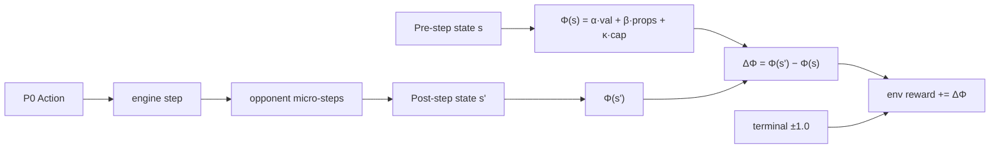

# RL reward recalibration — potential-based shaping (rewrite)

## What the old plan got wrong (load-bearing)

The prior plan compared **one-shot** capture chip (~+0.02) to a single-step value-channel hit for a dead Inf (~−0.002) and concluded capture was "10× too big." That arithmetic ignored that [`rl/env.py` lines 638–657](rl/env.py) emit the value and property terms as **levels per P0 step**, not deltas:

```638:657:rl/env.py
        if not done:
            p0_props = self.state.count_properties(0)
            p1_props = self.state.count_properties(1)
            diff = p0_props - p1_props
            if diff >= 0:
                reward += diff * 0.005
            else:
                reward += diff * 0.001

            p0_val = sum(
                UNIT_STATS[u.unit_type].cost * u.hp / 100
                for u in self.state.units[0]
                if u.is_alive
            )
            p1_val = sum(
                UNIT_STATS[u.unit_type].cost * u.hp / 100
                for u in self.state.units[1]
                if u.is_alive
            )
            reward += (p0_val - p1_val) * 2e-6
```

Cumulative impact across remaining episode steps:

- Lost Inf (Δval = −1000): −0.002 per step × ~100 remaining steps ≈ **−0.2** cumulative
- Killed enemy tank (Δval ≈ +7000): +0.014 per step × ~100 ≈ **+1.4** cumulative — **larger than terminal ±1.0**
- Property surplus +1: +0.005/step × ~50 steps ≈ **+0.25** cumulative

So the actual pathology is the opposite of the prior plan's claim: **value/property level shaping drowns both capture shaping and terminal reward**, and a dead Inf is already taxed harder than a chip rewards. Scaling capture down would have made it invisible.

## Design principle: potential-based shaping (Ng/Harada/Russell 1999)

For any potential `Φ(s)`, shaping `F(s,s') = Φ(s') − Φ(s)` is **policy-invariant**: it does not change the optimal policy under MDP value iteration. Cumulative shaping over a trajectory telescopes to `Φ(s_T) − Φ(s_0)`, bounded and finite. This is the textbook fix for the persistence bug.

Define one potential for the env:

```
Φ(s) = α · (p0_val − p1_val)
     + β · (p0_props − p1_props)
     + κ · Σ_{prop ∈ contested for P0} (1 − cp/20)
     − κ · Σ_{prop ∈ contested for P1} (1 − cp/20)
```

Where `contested for P` = property is neutral OR owned by opponent of P, AND has `cp < 20`. Per P0 step the env adds `Φ(s_after) − Φ(s_before)` to reward. The engine `_CAPTURE_*` constants and the first-attempt bonus are **disabled**.

Note on the contested-cap sign: the engine's `cp` is "points remaining to flip." A neutral property with `cp = 20` contributes 0; a half-chipped one with `cp = 10` contributes 0.5. The engine resets `cp = 20` on capturer death/move-off ([`engine/game.py:1290–1303`](engine/game.py)), so refund of accumulated chip is **automatic** in ΔΦ — no special-case shaping code.



## How each scenario plays out under one potential

| Story | Old (level + constants) | New (Φ-delta only) |
|---|---|---|
| Cap chip 10/20 on neutral | +0.02 (one-shot) + 0/step | +κ·0.5 (one-shot) |
| Capturer dies before flip | chip kept, value tax forever | chip refunded automatically (cp resets to 20 in engine), value Δ = −1000α, net negative in proportion to unit cost |
| Flip a property | +0.20 (one-shot) + +0.005/step forever | Φ_cap loses chip credit; Φ_props gains +β; net = +β − (chip_credit_returned). With β tuned to dominate, flip is clearly positive. |
| Counter-kill enemy tank after suicidal cap | +1.4 cumulative (drowns terminal) | +α·~7000 one-shot — bounded |
| Surplus 1 property all game | +0.25 cumulative | +β one-shot at flip |

Suicidal cap: agent loses Inf (−1000α via value potential) and gets the chip refunded (Φ_cap drop). Healthier than current — no first-attempt pat masking the loss.

Surviving multi-turn cap: chip credit persists in Φ_cap until flip, when it cleanly transfers to Φ_props (chip credit returns, +β kicks in).

## Coefficient targets (initial, tunable)

Anchor: **one full-HP Inf death ≈ −0.02** (matches the magnitude the user wants for "felt bad").

- `α = 2e-5` → 1000-value swing = ±0.02 one-shot
- `β = 0.05` → flip = +0.05 (less than terminal 1.0, larger than a single chip)
- `κ = 0.05` → full chip-out of one property = +0.05 (same order as flip; refunded if reset)

Sanity:
- Cap a building from neutral over two turns (chip 10 + chip 10 + flip): +0.025 + +0.025 cap-credit on Φ_cap, then on flip: −0.05 cap-credit + +0.05 prop = +0.05 net. Total trajectory: **+0.05**.
- Same but capturer dies after first chip: +0.025, then +0 (refund) − 0.02 (Inf value) = **−0.02**. Suicidal, net negative, in unit cost.
- Two-day "cap chip then Inf killed": +0.025 + (−0.025 refund) + (−0.02 Inf) = **−0.02**. Matches "felt bad."
- Trade after bad cap (cap chip → Inf dies → mech+arty kill the road tank for 7000 value): −0.02 (above) + +0.14 (tank kill) − unit losses on the trade. Clearly positive when the trade is favorable.

## Files to touch

| File | Change |
|---|---|
| [`engine/game.py`](engine/game.py) | `_apply_capture` returns 0.0 when `AWBW_REWARD_SHAPING=phi` (env-var read once at module import). Constants stay defined for backward-compat / legacy mode. Existing `cp = 20` reset on capturer death/move-off is preserved (already correct). |
| [`rl/env.py`](rl/env.py) | New module-level `_REWARD_SHAPING_MODE`, `_PHI_ALPHA`, `_PHI_BETA`, `_PHI_KAPPA` read from env. New `_compute_phi(state) -> float` helper. `step` snapshots Φ before engine + opponent micro-steps and after; replaces the level-form value/property block with `reward += phi_after − phi_before` when mode is `phi`. Level form retained as fallback (mode `level`, default for now). |
| [`tests/test_env_shaping.py`](tests) | New file. Four invariant tests: suicidal cap → trajectory shaping ≤ 0; successful 2-step cap on neutral → ≈ +β; favorable trade after lost Inf → net positive; Φ telescoping (sum of per-step ≈ Φ_T − Φ_0). |

## Risk notes / weak flanks

- **PPO value head was trained against level shaping.** Resuming from a checkpoint will drift the value head until it re-learns the new return distribution. Plan for a short scratch run before any production retrain.
- **Φ is computed once per env.step.** Opponent micro-steps inside `_run_*_opponent` happen between the two Φ snapshots and their effects fold into one ΔΦ. Acceptable; matches how reward is currently delivered.
- **Snapshot ordering.** Post-Φ must be taken AFTER opponent micro-steps and AFTER ownership flips, so chip credit returns exactly once on flip. Test (d) catches drift.
- **Income terminal and time-cost env vars unchanged.** They are intentional terminal/exploration knobs, not cumulative shaping over the trajectory.
- **No external callers of `_CAPTURE_SHAPING_*`** — confirmed by ripgrep. Oracle/replay paths use the engine but ignore reward; safe.

## Sequencing

1. Land Φ in [`rl/env.py`](rl/env.py) with the three env-vars; flag-gate behind `AWBW_REWARD_SHAPING=phi` so the old path stays default for one PR.
2. Gate engine capture-shaping emission off when `phi` is active.
3. Land the four invariant tests.
4. Short scratch training run (e.g. 1–2M steps) under `phi`; compare metrics to the level baseline.
5. If healthy, delete legacy level-shaping code paths and flip `phi` to default; re-tune α/β/κ from run-1 distributions.
