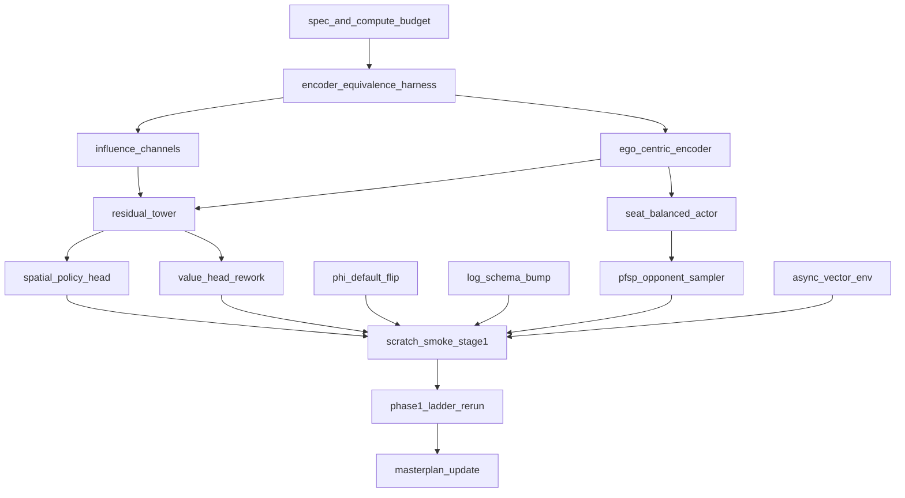

# Superhuman restart — architecture, encoder, training-paradigm bundle

## What this plan is

A single, atomic restart that bundles every change which would otherwise
each cost us a from-scratch training run. The triggering item is the
critique of [rl/network.py](D:\AWBW\rl\network.py): the current
`AdaptiveAvgPool2d((8,8)) → flatten → Linear(8192+17, 256) → Linear(256, 35_000)`
path is the wrong inductive bias for a positional 30×30 game and is
load-bearing on most of why we have not reached superhuman with the
existing trunk. Once we accept that fix, every other shape-locked
improvement (encoder channels, ego-centric frame, action layout, reward
default) becomes free to bundle, because the restart cost has already
been paid.

## Non-goals

- **Fog of war / POMDP work** — explicitly off-bundle per MASTERPLAN §8.
  Fog is a separate product line with its own checkpoint contract.
- **Native compilation (Cython / Numba / mypyc)** — MASTERPLAN §12 is
  shelved; the restart does not unblock it because the bundle does not
  change the engine internals it would target.
- **Hierarchical RL (Macro/Micro)** — Phase 3, MASTERPLAN §5. The new
  spatial head + influence channels may extend the flat-architecture
  plateau enough to make HRL deferrable; build, measure, then decide.
- **Full AlphaStar-style multi-population league** — PFSP sampling is in
  scope; persistent main-exploiter / league-exploiter populations are not.
- **MCTS production rollout** — Phase 2, MASTERPLAN §4. Prerequisite gates
  are unchanged; this bundle just makes the V(s) that MCTS will rely on
  a stronger evaluator.

## Repository truth

| Topic | Where |
|------|--------|
| Shipped policy/value net (restart stack) | [rl/network.py](D:\AWBW\rl\network.py) |
| Current encoder (channels and scalars) | [rl/encoder.py](D:\AWBW\rl\encoder.py) |
| Action space and mask construction | [rl/env.py](D:\AWBW\rl\env.py) |
| Self-play loop, opponent rotation, checkpoint pool | [rl/self_play.py](D:\AWBW\rl\self_play.py) |
| MaskablePPO trainer entry | [rl/ppo.py](D:\AWBW\rl\ppo.py), [train.py](D:\AWBW\train.py) |
| Reward shaping (Φ implementation) | [rl/env.py](D:\AWBW\rl\env.py), [tools/phi_smoke.py](D:\AWBW\tools\phi_smoke.py) |
| Phase / gate strategy | [MASTERPLAN.md](D:\AWBW\MASTERPLAN.md) §1, §3, §9, §11 |
| Curriculum execution plan | [.cursor/plans/phase1-foundation-validation.plan.md](D:\AWBW\.cursor\plans\phase1-foundation-validation.plan.md) |
| Reward-shaping plan (Φ origin) | [.cursor/plans/rl_capture-combat_recalibration_4ebf9d22.plan.md](D:\AWBW\.cursor\plans\rl_capture-combat_recalibration_4ebf9d22.plan.md) |
| Multi-PC sync (impacts FPS budget for tower sizing) | MASTERPLAN §10 |

## Bundle rationale — why now and why all at once

Restarting training is the binding cost. Every item in the table below
either changes the encoder shape, changes the policy/value head shape, or
changes the reward distribution that V(s) regresses against. Doing them
serially means N restarts; bundling means one.

| Change | Forces restart? | Bundled here? | Why |
|---|---|---|---|
| Spatial policy head | Yes (action head shape) | Yes | The trigger |
| **MOVE-encoding redesign** | **Yes (action layout, mask bits)** | **Yes (added post-wave-1 finding)** | **Without it, spatial head can't actually drive MOVE destination — wave-1 inventory composer proved `_action_to_flat` collapses all destinations to one flat index** |
| Wider/deeper residual tower | No (could be retrained from old encoder), but we are restarting anyway | Yes | Free with bundle |
| Drop AvgPool | Yes (changes feature shape into head) | Yes | Required by spatial head |
| Influence/threat channels (6) + defense_stars (1) | Yes (encoder channel count → 70) | Yes | Highest sample-efficiency lever |
| Ego-centric encoder | Yes (channel layout) | Yes | Unblocks §9 both-seats training |
| Φ reward as default + **learner-frame** | Yes (return distribution) | Yes | §11.4 default-flip moment + ego-centric §7 finding |
| Seat-balanced actor | No (data-collection only) | Yes | Free with ego-centric encoder; depends on it |
| PFSP opponent sampling | No (data-collection only) | Yes | Cheap; lets us validate league framing in the same eval window |
| AsyncVectorEnv swap | No (perf only) | Yes | Re-baselining gates twice is worse than bundling |
| Fog / POMDP | Yes | No | §8 — separate program |
| Native compilation | No (preserves obs) | No | §12 shelved |
| Hierarchical RL | Yes (architecture overhaul) | No | §5 — measure first |

## Architecture sketch (shipped; detail + param math in [docs/restart_arch/compute_budget.md](D:\AWBW\docs\restart_arch\compute_budget.md))

Trunk:

```text
spatial (B, H, W, C_new)  →  permute → (B, C_new, H, W)
  → Conv2d(C_new, F, 3, pad=1) + GroupNorm + ReLU
  → ResBlock × N         (stride 1 throughout, no AvgPool)
  → features (B, F, H, W)             # F ≈ 128–192, N ≈ 10–16
```

Heads:

```text
Spatial policy:
  per action-type k ∈ {move, attack, capture, build, ...}:
    Conv2d(F, K_k, 1) → (B, K_k, H, W) → flatten → reproject to flat index space
  scalar action-types (END_TURN, COP, SCOP):
    GAP(features) → Linear → logits

Value:
  Conv2d(F, F/4, 1) → ReLU → Conv2d(F/4, 1, 1) → GAP → tanh → scalar
```

Encoder additions (final list set by spec todo, not exhaustive):

- Threat-in (per-side): expected damage incoming to each tile next turn
- Reachability frontier (per-side): reuse engine BFS over move costs
- Turns-to-capture (per side, per property tile)
- Ego-centric channel ordering: own / enemy block instead of P0 / P1 block

## Critical section — risks and what not to do

- **Don't bundle fog.** It looks adjacent (encoder + value-head changes)
  but is its own checkpoint contract per MASTERPLAN §8.1. Bundling would
  silently force the same restart again the moment we want a non-fog model.
- **Don't expand the action space while changing its representation.**
  Keep the legal action set behaviourally identical; only the
  policy-head wiring changes. If we want new action types (e.g. higher-level
  build orders), do that as a separate bundle after the new architecture
  ships and the gates are met.
- **GroupNorm vs BatchNorm.** PPO collects small minibatches; BN can
  destabilize the value head when batch statistics drift between rollout
  and update. Default to GroupNorm or LayerNorm in the new tower; treat
  any decision to keep BN as needing an explicit justification.
- **Don't trust old `explained_variance` thresholds.** The MASTERPLAN §3
  gates are correct in spirit but the numerical baselines were measured
  against the old return distribution and the old head. After the
  restart, re-derive what "stable plateau" looks like before declaring
  Stage gates met.
- **Don't ship PFSP without the seat-balanced actor.** PFSP weights
  opponents by win rate; if the learner only ever plays as P0, the win
  rates are conditional on a seat the learner cannot escape, and the
  sampler will overweight asymmetric matchups for the wrong reason.
  Order matters — `seat-balanced-actor` before `pfsp-opponent-sampler`.
- **Don't delete the pre-restart checkpoint line.** Keep it on disk for
  (a) regression-tower comparisons, (b) optional behaviour cloning warm
  starts on the new architecture, and (c) honest "did the new arch
  actually beat the old one?" head-to-head evals via the existing pool /
  shared-latest gate.
- **Encoder equivalence harness comes first.** Without it, every future
  encoder edit risks silent shape drift; with it, future architectural
  iterations can be reasoned about without paying another restart.
  Build the harness against today's 63-channel encoder before we touch
  anything.
- **MCTS prereqs are unchanged.** This bundle does not satisfy
  MASTERPLAN §4.2 Phase 2 gates by itself — Phase 1 Full on the new
  architecture is still the prerequisite for production MCTS.

## Bundle vs incremental — items deliberately deferred

These are real improvements, but their cost-benefit is better outside
this bundle:

- **Macro/Micro hierarchical RL.** The new spatial head provides
  per-tile policy logits; that is materially closer to "tell each unit
  where to go" than the old flat head. Plausible the flat-architecture
  plateau moves out far enough that HRL becomes a Phase 3 decision, not
  a Phase 1 emergency. Decide after the new ladder runs.
- **Multi-population league (main-exploiter, league-exploiter).** PFSP
  on the existing pool gets us 80% of the "counters all-in *and*
  counters turtle" benefit at 10% of the engineering cost. Revisit if
  the bundle plateaus under PFSP.
- **Auto-regressive action decoder (AlphaStar-style).** The factored
  spatial head is sufficient for AWBW's action structure; an
  auto-regressive head only earns its complexity if we see specific
  evidence of conditional-action pathologies (e.g. picking the right
  unit but the wrong target tile despite a strong threat map).
- **Belief-conditioned value head.** Out of scope under the §8 fog
  separation; would only earn its keep on a fog product line.

## Diagram — bundle dependency order



## After confirmation

Execute todos in dependency order — `spec-and-compute-budget` first
(nothing else proceeds without the shape contract and FPS budget on
disk), then `encoder-equivalence-harness` (so subsequent encoder diffs
are auditable), then encoder edits, then network, then training-paradigm
edits, then the scratch smoke. Phase 1 ladder rerun is governed by the
existing
[.cursor/plans/phase1-foundation-validation.plan.md](D:\AWBW\.cursor\plans\phase1-foundation-validation.plan.md);
this plan only tracks "the ladder runs on the new contract." Update todo
`status` in this file's frontmatter as items complete.

---

## Plan file

```text
D:\AWBW\.cursor\plans\superhuman_restart_architecture_bundle.plan.md
```
