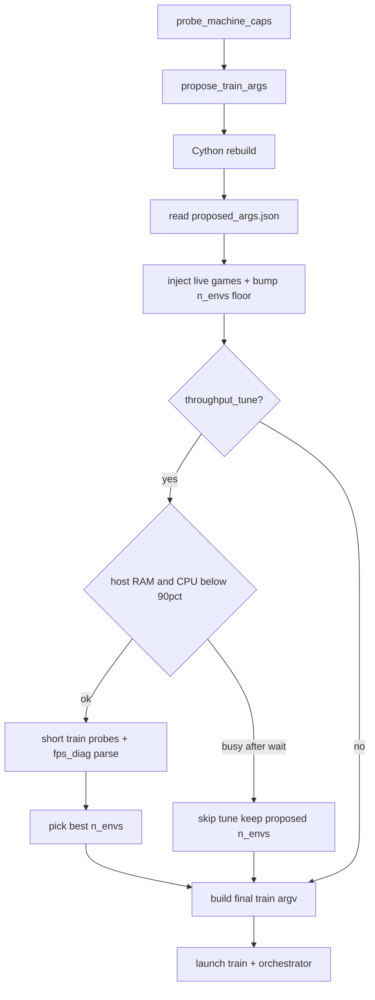

# Throughput auto-tune in `start_solo_training`

## Goals and non-goals

- **Goal:** Before long training, optionally **measure** steady-state `env_steps_per_s_total` (same metric as [`rl/self_play.py`](D:\AWBW\rl\self_play.py) / [`tools/bench_train_throughput.py`](D:\AWBW\tools\bench_train_throughput.py)) over a small grid of `--n-envs`, then **write the winner** into [`fleet/<id>/proposed_args.json`](D:\AWBW\fleet\pc-b\proposed_args.json) (same as today’s post-sync write) so the launched `train.py` matches.
- **Non-goal (v1):** Auto-tune `--batch-size` / `--n-steps` (VRAM + sample-efficiency tradeoffs); auto-tune **only** `--n-envs` unless you explicitly expand later.
- **Non-goal:** Run probes on every bootstrap. That would add minutes and surprise operators. **Default remains unchanged**; tuning is gated on a new flag (see below).

## Why not tie tuning to `--auto-apply` alone

[`--auto-apply`](D:\AWBW\scripts\start_solo_training.py) only affects [`fleet_orchestrator.py`](D:\AWBW\scripts\fleet_orchestrator.py) restarts. Mixing “orchestrator may respawn train” with “always run 3–5 short trains first” conflates two concerns and makes fleet behavior hard to predict. **Recommendation:** document that **`--throughput-tune` pairs well with `pc-b --auto-apply`**, but keep tuning **opt-in**.

## Design

### 1) New CLI on `start_solo_training.py`

Add flags (names can be bikeshedded):

- `--throughput-tune` — run the micro-sweep after `probe` + `propose` + Cython rebuild, **before** building the final `train_argv`.
- `--throughput-tune-max-envs N` — hard ceiling for candidates (default: **reuse [`PC_B_MAX_ENVS = 4`](D:\AWBW\tools\propose_train_args.py) when `machine_id == pc-b`**, else a heuristic cap from probe RAM/cores, e.g. `min(12, max_safe)` aligned with `propose_from_probe`).
- `--throughput-tune-per-candidate-s` — wall timeout per candidate (default **90–120s**); treat timeout as failed sample for that `n`.
- `--throughput-tune-min-iters` — total train timesteps per probe (default **~2–4 full rollouts**, e.g. `max(32_768, 2 * n_steps * n_envs)` computed per candidate so `fps_diag` gets several rows).
- `--throughput-tune-max-host-ram-pct` / `--throughput-tune-max-host-cpu-pct` — defaults **90** each; tuning **must not** start or continue a probe while the **host** is already at or above these utilizations (see §Host headroom).

**Dry-run:** If `--dry-run-bootstrap` + `--throughput-tune`, print the candidate list and the planned probe command shape (no subprocess).

### 2) Refactor shared FPS parsing (avoid duplication / bugs)

[`tools/bench_train_throughput.py`](D:\AWBW\tools\bench_train_throughput.py) already implements `parse_fps_diag_lines` + `summarize_fps`. **Extract** to a tiny module, e.g. [`tools/fps_diag_metrics.py`](D:\AWBW\tools\fps_diag_metrics.py), and import it from `bench_train_throughput.py` and the new tuner.

**Fix while touching this:** `bench_train_throughput.py` currently invokes `train.py` **without** `--machine-id`; [`train.py`](D:\AWBW\train.py) only auto-enables `AWBW_FPS_DIAG` when `AWBW_MACHINE_ID` is set (lines 585–590). Probes **must** pass `--machine-id <id>` (or set env) so `fps_diag.jsonl` is populated.

### 3) Core algorithm (new module)

Add [`tools/throughput_tune.py`](D:\AWBW\tools\throughput_tune.py) (or `scripts/` if you prefer no `tools` import from `scripts`; `start_solo_training` already runs `tools/*.py` via subprocess — **prefer importing** the module from `start_solo_training` to avoid nested subprocess complexity).

Function sketch:

```python
def choose_n_envs_throughput(
    *,
    machine_id: str,
    proposed: dict,
    train_extra: list[str],  # after live inject
    gids: list[int],
    max_envs: int,
    per_candidate_s: float,
    min_iters: int,
    max_host_ram_pct: float,
    max_host_cpu_pct: float,
    repo_root: Path,
    log: logging.Logger,
) -> tuple[int, dict]:  # winner + diagnostic report dict
```

### Host headroom (shared machine: avoid freezing)

**Requirement:** Do **not** drive the **system** past **90% RAM or 90% CPU** while probing, so a desktop used for other work stays responsive. Defaults: **90 / 90**; overridable via CLI flags above.

**Mechanism (v1):**

1. **Pre-flight (before the sweep):** If `psutil.virtual_memory().percent >= max_host_ram_pct` **or** `psutil.cpu_percent(interval=0.25) >= max_host_cpu_pct`, **do not run the sweep** — log a clear message and return the current proposed `--n-envs` (no change). Same check **immediately before each candidate** after optional idle wait.
2. **Idle wait:** If a check fails, **wait** (poll every 2–5s) for up to **~30–60s**; if host drops **below** threshold (e.g. use a small hysteresis: treat “ok” as `< max - 5` or `< 85%` to avoid flapping), start the probe; otherwise **skip this candidate** or **abort the whole tune** (prefer **abort** after first skip to avoid partial grids — document in log; operator can retry when idle).
3. **Ceiling on `n_envs`:** Even below 90% RAM, **do not add candidates** that `propose_train_args`-style heuristics would already reject (e.g. `n_envs` such that expected worker RSS would push past headroom — optional v1.5: `available_gb` must stay **≥ reserved headroom**, e.g. **≥ 4–8 GiB free** before trying the next higher `n`).
4. **Process priority:** After spawning `train.py` for a probe, lower the **child process tree** priority where the OS allows (**Windows:** below-normal / `IDLE_PRIORITY_CLASS`; **Linux:** `nice` + optionally `os.sched_setscheduler` not required) so interactive apps keep precedence. This does **not** replace the 90% checks but improves “shared PC” feel.
5. **Long-running training (post-tune):** This plan only adds guards to the **tuning sweep**. Full `train.py` is unchanged; if you want the same 90% policy for the main run, that is a **separate** follow-up (e.g. cap `n_envs` in `proposed` by free RAM, or document operator-set `--n-envs`). Mention in docstring.

**Note:** `psutil.cpu_percent` is **system-wide**, matching Task Manager’s overall CPU story. Memory uses `virtual_memory().percent` (same caveats as Windows “in use” vs compressed — still a practical guard).

**Honest limit:** Guards are **advisory between candidates** (and before start). A probe subprocess can still **spike** above 90% for short intervals once started. Mitigations: **below-normal priority**, **short** `per_candidate_s` / `min_iters`, and **abort** if a post-probe sample shows sustained violation. A **hard** cap for the whole process tree would need OS-level controls (Windows job objects / Linux cgroups) — **out of scope for v1** unless you add it later.

**Candidate list:**

- `floor = max(len(gids), int(proposed["args"].get("--n-envs", 4)))` after [`_bump_n_envs_in_proposed_for_live`](D:\AWBW\scripts\start_solo_training.py) (live PPO requires at least one worker per game).
- `ceiling = max_envs` further limited by **host headroom**: if memory or CPU is already at/above the configured max before trying a larger `n`, **do not** run that candidate (see above); never “force” a higher `n_envs` when the sweep was skipped.

**Per candidate `n`:**

1. `am = copy.deepcopy(proposed["args"]); am["--n-envs"] = n`
2. Ensure `batch_size <= n_steps * n` (if not, clamp batch for probe only — log once).
3. Build argv via existing [`_build_train_argv`](D:\AWBW\scripts\start_solo_training.py) / `fleet_orchestrator.build_train_argv_from_proposed_args` with `doc = {**proposed, "args": am}`, **same** `train_extra` as production (so live snapshot args match).
4. Replace / append `--iters` to `min_iters` (last `--iters` wins if helper merges).
5. Record `fps_diag.jsonl` size offset; `subprocess.run(argv, cwd=repo_root, timeout=per_candidate_s, env=os.environ | AWBW_MACHINE_ID + DEFAULT_TRAIN_PERF_ENV as appropriate)`.
6. Parse new lines; score **`median` of `env_steps_per_s_total`** (fallback: `env_steps_per_s_collect` if total missing).
7. Pick **max median**; tie-break **lower `n`** (RAM / straggler friendliness).

**Report artifact:** Write [`fleet/<id>/throughput_tune.json`](D:\AWBW\fleet\pc-b) (atomic JSON) with candidates, medians, winner, timestamps, git sha optional — helps debug “why did it pick 3?”.

### 4) Wire into `start_solo_training.main`

Insert **after** `proposed = _read_json(proposed_path)` and **after** Cython rebuild, **before** final `train_argv` build:

1. `extra, gids = _inject_live_games_train_extra(...)` (refactor slightly so this runs once before tune — today it’s only inside `_compose_train_argv_with_live_ppo`; split **inject + refresh + bump** from **build argv** to avoid duplication).
2. `if gids: _refresh_live_engine_snapshots_if_stale(...); _bump_n_envs_in_proposed_for_live(proposed, len(gids), log)`
3. `if args.throughput_tune: n = choose_n_envs_throughput(...); proposed["args"]["--n-envs"] = n; merge reasoning string into proposed` (e.g. append to `reasoning` field).
4. `train_argv = _build_train_argv(proposed, ..., train_extra=extra, ...); _ensure_train_argv_n_envs_for_live(...)`

This preserves the existing invariant that **live games** force `n_envs >= len(gids)**.

### 5) Tests

- **Unit:** `choose_n_envs_throughput` with **mocked** `subprocess.run` writing synthetic `fps_diag` fragments (or temp jsonl append).
- **Integration-light:** Refactored `_compose_...` path still passes existing tests in [`tests/test_start_solo_training.py`](D:\AWBW\tests\test_start_solo_training.py); add one test that `--throughput-tune` with monkeypatched tuner sets `--n-envs` in proposed.
- **Regression:** [`tests/test_propose_train_args.py`](D:\AWBW\tests\test_propose_train_args.py) unchanged unless you later feed tune results into `propose_train_args` (not planned).

## Risks and mitigations

| Risk | Mitigation |
|------|------------|
| Probes steal 5–10+ minutes | Opt-in flag; short per-candidate timeout; small `min_iters` |
| Tune picks `n` that OOMs | Host RAM headroom (90% default); free-GB floor optional; pc-b cap; tie-break lower `n` |
| Shared PC freezes during sweep | **No probe** while host RAM or CPU ≥ 90% (configurable); idle-wait then skip/abort; below-normal probe priority |
| Probe workload ≠ production | Reuse `build_train_argv_from_proposed_args` + same `train_extra` (live, curriculum flags) |
| `fps_diag` sparse / empty | Treat as failed candidate; fall back to `propose_train_args` value |

## Mermaid — bootstrap with optional tune


