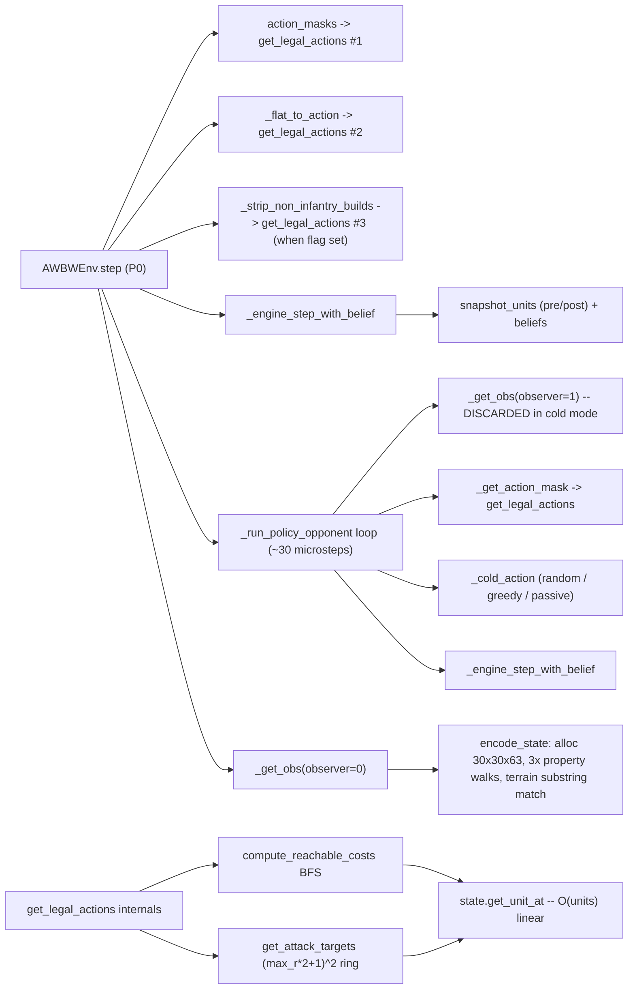
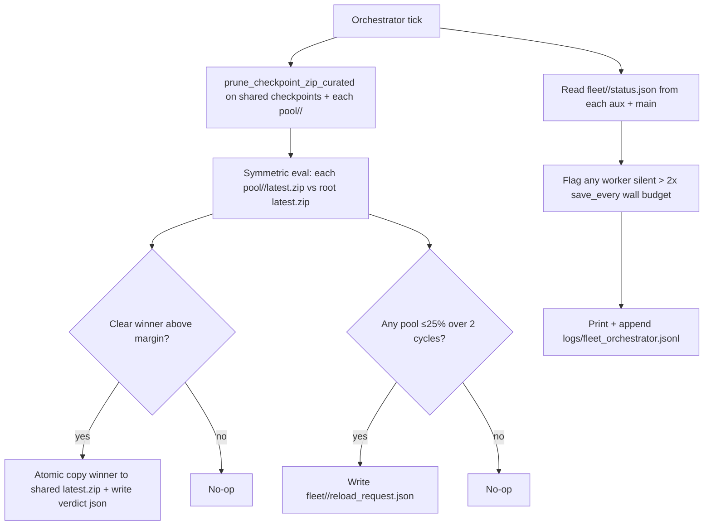
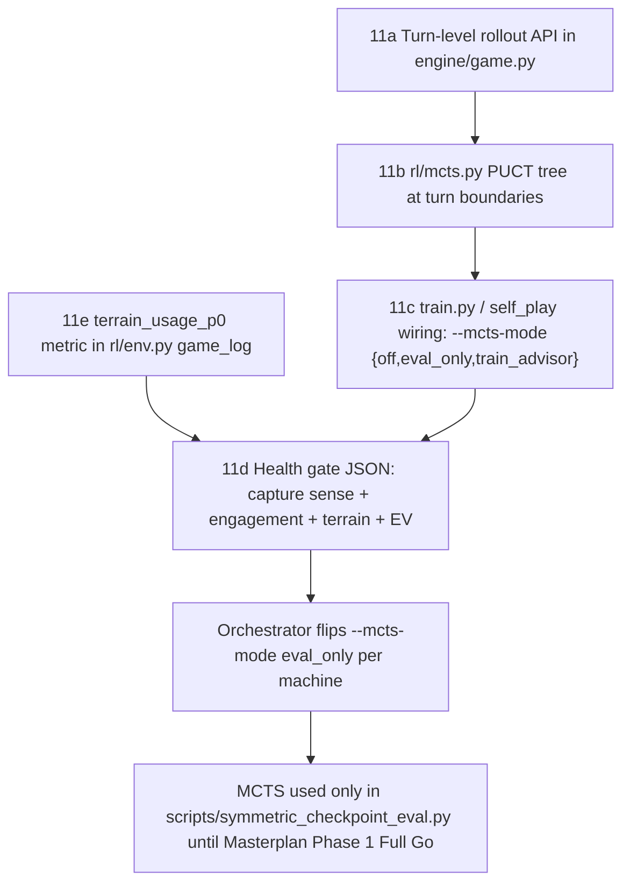

# train.py / RL throughput campaign

Current measured throughput: **~26 env steps/s** total (~4.3/worker at n_envs=6). Cold opponent confirmed (no `_CheckpointOpponent._model` loaded; `_cold_action(mask)` is what fires). 1200 desyncs were closed in the last few days — we cannot trust git bisect, and we cannot afford a regression in engine/oracle behavior. The hard constraint: **every change ships with the full pytest suite green**, and engine-touching changes ship behind a feature flag until oracle slices re-confirm equivalence.  The orchestrator must be able to work with any number of aux machines.  

## What the prior plan got wrong

- **Mis-ordered.** Led with legal-action dedup. The dedup is real (`get_legal_actions` runs 3x per P0 step), but the dominant cost per `get_legal_actions` call is the Python lookups it makes — `state.get_unit_at` is O(units) linear scan and is invoked from the BFS in `compute_reachable_costs` for every edge expansion plus every attack-target tile (`engine/action.py:279, 290, 370`) and again twice in `_get_action_actions`. Dedupping a slow function is a smaller win than making it fast.
- **Treated opponent inference as Phase 4.** True cost when checkpoints exist, but the user runs cold today — there is no `model.predict` in the loop right now. Defer this work.
- **Missed the free regression in `_run_policy_opponent`.** `[rl/env.py:1026](rl/env.py)` computes `obs = self._get_obs(observer=1)` unconditionally before calling the opponent, even when the cold-opponent code path only consumes `mask`. That is a 30×30×63 float32 allocation and a full encoder Python loop thrown away **per P1 microstep, per env**.
- **Missed the encoder allocation churn.** `np.zeros((30, 30, 63), dtype=float32)` = ~227 KB per call, plus `np.zeros(35_000, dtype=bool)` for the mask. Both per env step. Reusing an env-owned buffer is a few-line change with no behavior risk.
- **Missed the encoder's substring match per tile.** `_get_terrain_category` (`rl/encoder.py:127`) does `for cat, idx in TERRAIN_CATEGORIES.items(): if cat in name` for every tile, every `encode_state`. Should be a precomputed `terrain_id -> category` table built once at import.
- **Missed map-static caching.** Terrain channels (15 of 63) are functions of `MapData.terrain` only — invariant across the entire episode. Should be cached per `MapData` and sliced/copied into the buffer once per encode.
- **Missed Action object churn.** `_get_select_actions`, `_get_move_actions`, `_get_action_actions` instantiate hundreds of `@dataclass Action` instances per `get_legal_actions` call. Substantial GC pressure. Cheap mitigation: `__slots_`_ on `Action`. Bigger lever (Phase 8): emit `(type, unit_pos, move_pos, target_pos, unit_type)` tuples in the hot loop, only materializing `Action` for the one we execute.
- **Missed thread oversubscription.** No `torch.set_num_threads(1)` / `OMP_NUM_THREADS=1` / `MKL_NUM_THREADS=1` in spawn workers. With n_envs=6 and torch's default thread pool, workers contend for the same physical cores — adds tail latency that SubprocVecEnv synchronously waits on.

## Current hot path (cold opponent, n_envs=6, narrow curriculum)




**Observation:** every red node is a Python-level scan that scales with units or board size, and most of it is downstream of one missing primitive — a tile-indexed unit/property grid on `GameState`.

## Strategic constraint (do not negotiate this)

The 1200-desync rebuild gives the engine an enormous regression surface. Every change must satisfy:

- `python -m pytest -q --tb=line` clean (matches `[.github/workflows/ci.yml](.github/workflows/ci.yml)`).
- Engine-touching changes (Phase 2, 5) ship behind a feature flag (env var, default OFF), with full oracle slice rerun before the flag flips default-on. The skill `awbw-regression-then-ship-main` applies: green pytest → commit → push → ship.
- Any cache keyed across calls is **state-keyed and intra-call only** — no cross-state cache. That's how desyncs are born.

## Phase 0a — Pre-bake instrumentation (lands BEFORE the multi-day bake)

Three lightweight additions, no engine touch, no behavior change. Cumulative ~5–15 LOC each. All measured at episode boundary or rollout boundary so they cannot bias hot-path timing.

### 0a.1 — Env-collect vs PPO-update split per rollout

Extend `[_build_diagnostics_callback](rl/self_play.py)` (the existing SB3 `BaseCallback`). Add `time.perf_counter()` deltas:

- `_on_rollout_start` → `_on_rollout_end` = env-collect wall.
- `_on_rollout_end` → next `_on_rollout_start` = PPO-update wall.
- Total rollout env steps from `n_envs * n_steps`.

Publish to TensorBoard:

- `diag/env_collect_s`
- `diag/ppo_update_s`
- `diag/env_steps_per_s_collect` (env steps / env_collect_s)
- `diag/env_steps_per_s_total` (env steps / (env_collect_s + ppo_update_s))

**Answers:** are we env-bound or learner-bound at n_envs=6?

### 0a.2 — Per-episode P0 vs P1 wall split

In `[AWBWEnv.reset](rl/env.py)` initialize `self._wall_p0_s = 0.0`, `self._wall_p1_s = 0.0`. In `step`:

- `t0 = time.perf_counter()` at top of `step`.
- After P0 decode + `_engine_step_with_belief` returns: `self._wall_p0_s += time.perf_counter() - t0`.
- Wrap the `_run_*_opponent` call: `t1 = time.perf_counter(); ...; self._wall_p1_s += time.perf_counter() - t1`.

Add to `log_record` in `_log_finished_game`: `wall_p0_s`, `wall_p1_s`. Also bump `log_schema_version` to `"1.6"`.

**Answers:** is the P1 microstep loop dominant (justifying Phase 1a's ROI), or is P0's own step the bigger eater? Settles the cold-opp obs-skip estimate before we touch code.

### 0a.3 — Per-worker RSS at episode end

In `_log_finished_game`, one call:

```python
import psutil
worker_rss_mb = psutil.Process().memory_info().rss / (1024 * 1024)
```

Add to `log_record`. `psutil` is already a transitive dep via SB3; if not, add to `requirements.txt`.

**Answers:** actual per-worker memory footprint vs the "~2–3 GB" comment in `[train.py:51](train.py)`. Critical input for the Phase 6 n_envs sweep ceiling.

### Test gate for Phase 0a

- `python -m pytest -q --tb=line` — must pass; only touch is additive log fields and one callback method.
- Spot-check: tail one `game_log.jsonl` row after a single completed game to confirm fields are present and finite.
- Confirm TensorBoard scalars appear under the existing `diag/` namespace.

**Regression after Phase 0a:** none (all additions are at episode/rollout boundaries; hot path untouched).

## Phase 0 — Baselines and targeted profile (after the bake completes)

1. **Mine the data we already have first.** Tail `[logs/slow_games.jsonl](logs/slow_games.jsonl)` and `[logs/game_log.jsonl](logs/game_log.jsonl)`; pull `episode_wall_s`, `p0_env_steps`, `max_p1_microsteps`, `approx_engine_actions_per_p0_step`, **and the new `wall_p0_s` / `wall_p1_s` / `worker_rss_mb`**. If median is fine but tail is brutal, straggler problem; if median slow too, hot-path problem (likely).
2. **Mine the new TensorBoard diagnostics** from Phase 0a.1: env-collect vs PPO-update ratio across the bake. If env-collect dominates (expected), Phases 1–4 are all in scope; if PPO-update dominates, pivot to learner-side optimization (batch size, n_steps, head compression).
3. **Add `tools/_train_microbench.py`** (delete after use, like `[tools/_disk_io_bench.py](tools/_disk_io_bench.py)`). Single-process: `reset` + N steps with random actions, fixed seed, `AWBW_LOG_REPLAY_FRAMES=0`, narrow curriculum. Print env steps/s and a per-call cumulative time table for `get_legal_actions`, `encode_state`, `_engine_step_with_belief`. Repeatable across phases.
4. `**py-spy record --subprocesses --rate 200 -o profile.svg --` on a 60s real `train.py` chunk** with cold opponent, narrow curriculum, n_envs=6. Source of truth for which Python frames eat wall time across SubprocVecEnv children.
5. **Capture a "cold + checkpoint" pair** of profiles even though we run cold today, so the deferred Phase 7 has data ready.

**Regression after Phase 0:** none.

## Phase 1 — Free wins (no engine changes, no behavior changes)

These are mechanical, test-cheap, and reversible. Land them as one slice or three small ones.

### 1a. Skip wasted `_get_obs(observer=1)` in cold opponent loop

In `[rl/env.py:1026](rl/env.py)` `_run_policy_opponent` always calls `obs = self._get_obs(observer=1)`. The cold opponent (`_CheckpointOpponent._cold_action`) only reads `mask`. Add `needs_observation()` on the opponent protocol; default True for true policies, False for cold variants and `_passive_cold_action`. When False, pass `obs=None`. Existing checkpoint path is unaffected.

Expected win (cold today): ~30 encode_state calls eliminated per P0 step. Likely the single largest free win.

### 1b. Per-env preallocated buffers

- `_get_action_mask` allocates `np.zeros(35_000, dtype=bool)` every call. Hold a `self._mask_buf` on `AWBWEnv`, `mask_buf.fill(False)` then write. Returned mask is a view; copy on the SB3 boundary if SB3 mutates (it doesn't — it casts to torch).
- `encode_state` allocates a fresh `(30, 30, 63)` float32 every call. Add an env-owned `self._spatial_buf` and `self._scalars_buf` and pass them in via a kwarg `out=`. Zero-fill at top of `encode_state`. **Mandatory** new test: golden checksum on a fixed `GameState` fixture, run twice in a row to catch any forgotten channel-clear.

### 1c. Thread caps in SubprocVecEnv worker init

Workers spawn on Windows; each one imports torch via `_CheckpointOpponent` (and via `MaskablePPO` predict on the learner side). torch defaults to ~physical cores threads per process. With n_envs=6 we're oversubscribed before the GPU even runs.

In `[rl/self_play.py:_make_env_factory._init](rl/self_play.py)`, set **before any torch import**:

```python
import os
os.environ.setdefault("OMP_NUM_THREADS", "1")
os.environ.setdefault("MKL_NUM_THREADS", "1")
os.environ.setdefault("OPENBLAS_NUM_THREADS", "1")
import torch
torch.set_num_threads(1)
```

These are env-vars; safe across the whole worker. Verify no test asserts otherwise.

**Regression gate:** `python -m pytest -q --tb=line`. Re-run the Phase 0 microbench. Expected: low-double-digit % FPS lift on its own; the combination with Phase 1a should be substantially larger when cold.

## Phase 2 — Engine spatial index (the cascade lever)

### Problem

`GameState.get_unit_at` (`engine/game.py:305`) and `get_property_at` (`:329`) are O(units) and O(properties) linear scans. They are called from:

- `compute_reachable_costs` BFS — every edge expansion (`engine/action.py:279, 290`).
- `get_attack_targets` — every tile in the (max_r·2+1)² ring (`engine/action.py:370`).
- `_get_action_actions` — twice (`engine/action.py:589, 602`).
- `encode_state` capture-progress — once per property tile per encode (`rl/encoder.py:211`).
- `_get_select_actions` empty-factory check (`engine/action.py:529`).
- `_engine_step_with_belief` attacker/defender resolution and the post-step rebuild (`rl/env.py:904, 905, 923`).

Roughly: hundreds of linear scans per `get_legal_actions` call, scaling with both units and reachable tiles.

### Direction

Add to `GameState`:

```python
self._unit_grid: dict[tuple[int, int], Unit] = {}
self._property_grid: dict[tuple[int, int], PropertyState] = {}
```

Populate on `make_initial_state`. Maintain on:

- Unit move (engine `_apply_move`, `_apply_join`, `_apply_load`, `_apply_unload`).
- Unit build (`_apply_build`).
- Unit kill / OOZIUM eat (combat path, `_apply_attack`).
- Property capture (`_apply_capture`) — `_property_grid` ownership lookups.

`get_unit_at` becomes `self._unit_grid.get((row, col))`; same for `get_property_at`. **Keep the linear-scan path as a verifier behind an env var** for one full cycle — `AWBW_UNIT_GRID_VERIFY=1` asserts both implementations agree on every call. Run the verifier across the full pytest + a desync_audit sample before flipping default-on.

### Safety

- Behind feature flag `AWBW_UNIT_GRID=1` (default OFF) for landing PR.
- Verifier env var `AWBW_UNIT_GRID_VERIFY=1` runs both paths and asserts equality.
- Run `python -m pytest -q --tb=line` with `AWBW_UNIT_GRID=1 AWBW_UNIT_GRID_VERIFY=1` set.
- Run desync_audit on a sample before flipping default.
- Skill `desync-triage-viewer` is the closure pattern if anything trips.

**Why this is the lead change:** every later phase (encoder, legal-action dedup, belief diff) gets faster automatically once these primitives are O(1). It is also the one change with non-trivial semantic risk, so it lands first under heavy gating while the small wins ship in parallel.

## Phase 3 — Encoder hotpath (`rl/encoder.py`)

After Phase 1b (preallocated buffer) and Phase 2 (O(1) lookups), still kill:

### 3a. Terrain category LUT

`_get_terrain_category` (line 127) substring-matches against `TERRAIN_CATEGORIES` per tile per encode. Build a module-level `_TERRAIN_ID_TO_CATEGORY: dict[int, int]` populated once by walking every known terrain id through the existing logic. Replace the per-tile call with `_TERRAIN_ID_TO_CATEGORY[terrain_id]`. Result is identical by construction — covered by golden-shape test from 1b.

### 3b. Map-static terrain channel cache

Terrain channels (15 of 63) depend only on `state.map_data.terrain`. Cache per `MapData`:

```python
# Lazy attribute, computed once per MapData on first encode_state for that map.
md._encoded_terrain_channels: np.ndarray  # shape (GRID_SIZE, GRID_SIZE, 15)
```

In `encode_state`, slice or `np.copyto` the cached block into `spatial[..., terrain_offset:terrain_offset+15]`. Replaces the H×W Python loop entirely for terrain.

### 3c. Fuse three property walks into one

Property ownership (line 174), capture-progress (line 204), and neutral-income mask (line 208) currently iterate `state.properties` three times. Fold into a single loop. With Phase 2's `_unit_grid`, the `get_unit_at` inside the capture-progress branch is O(1), so the fused loop is strictly cheaper.

**Regression:** Existing pytest + the golden-encoder test added in 1b (asserts the spatial+scalars output is byte-identical for a fixed fixture before/after). Mandatory.

## Phase 4 — Legal-action dedup

Now that `get_legal_actions` is much cheaper (Phase 2), the 3x-call problem is smaller — but still pure win.

### Direction

Cache `(legal_list, flat_index_array)` per state snapshot, keyed by an `id(state)` + `state.action_stage` + a "mutation counter" we bump on any engine-mutating method. Cache lives **on the env instance**, intra-step lifetime only.

- `_get_action_mask` returns `mask` derived from cached `flat_index_array`.
- `_flat_to_action` resolves via `idx -> Action` map from the cache.
- `_strip_non_infantry_builds` filters indices using the cache (no second `get_legal_actions`).

Cache invalidates the moment `state.step(...)` runs.

### Safety

- Targeted: `[tests/test_rl_action_space.py](tests/test_rl_action_space.py)`, `[tests/test_engine_legal_actions_equivalence.py](tests/test_engine_legal_actions_equivalence.py)`, `[tests/test_self_play_smoke.py](tests/test_self_play_smoke.py)`, `[tests/test_capture_move_gate.py](tests/test_capture_move_gate.py)`.
- Hard rollback if any flat index is added to / removed from the legal mask.

## Phase 5 — Phi/level shaping fusion + belief diff trims

After profile, only if it shows up:

- Fuse the per-step material+property scan: `_compute_phi` (`rl/env.py:792`) and the level-shaping computation in `step` (lines 692–711) walk `state.units[0/1]` and `state.properties` independently. With phi mode active, that's two passes around the engine step; merge into one pre-step + one post-step pass.
- `_snapshot_units` / `_engine_step_with_belief`: dict allocations per microstep are non-trivial. Cheap mitigation: pre-size `pre` and `post_by_id` dicts; reuse a per-env scratch dict cleared each call. Bigger: when no HP-mutating action ran (most microsteps that aren't ATTACK/repair/heal), skip the per-unit HP diff loop entirely — gate on `action.action_type` and the post-step turn-marker so day-start-heal is not missed.

**Regression:** `[tests/test_hp_belief.py](test_hp_belief.py)`, `[tests/test_env_shaping.py](tests/test_env_shaping.py)`, and any phi-targeted test.

## Phase 6 — `n_envs` sweep + straggler diagnosis

Comment in `[train.py:48](train.py)` already notes ~2–3 GB per worker. With 64 GB host RAM and Phase 1c reining in thread oversubscription, the realistic ceiling is much higher than 6. After Phases 1–4 land:

- Sweep `n_envs ∈ {6, 8, 12, 16}` × `n_steps ∈ {256, 512, 1024}` on cold opponent. Plot env steps/s and `diag/episodes_per_rollout` (already published by `[_build_diagnostics_callback](rl/self_play.py)`).
- Cross-check `slow_games.jsonl`. If a small fraction of games carries the bulk of the wall time, tighten `max_p1_microsteps` for cold opponent (the stalemate "stay-in-place forever" case) and consider a per-episode wall-time truncation.

## Phase 7 — DEFERRED: Opponent inference

When checkpoint opponent comes back, `_CheckpointOpponent.__call__` runs the full ResNet on CPU per P1 microstep, per env. At that point this leaps to top priority. Hold the ground but do not invest engineering until checkpoints are loaded again. Levers (in order of risk):

- Tune `_refresh_every` and `opponent_mix`.
- TorchScript / ONNXRuntime on the opponent path (touches `[rl/ckpt_compat.py](rl/ckpt_compat.py)`; design spike + Imperator approval).
- Distilled smaller P1 net.
- Batch opponent inference across n_envs (architectural; ties to MASTERPLAN §10).

## Phase 8 — Speculative bigger levers (only if Phase 1–6 fall short)

- **Cython / numba on `compute_reachable_costs`.** Pure numeric BFS over a small grid; great fit. Phase 2 already removes the `get_unit_at` cost inside it, so this is gravy.
- `**__slots__` on `Action`** (or a NamedTuple) — kill GC pressure from hundreds of dataclass instances per `get_legal_actions` call. Behaviorally invisible.
- **Lazy/compact action enumeration**: emit `(type, unit_pos, move_pos, target_pos, unit_type)` tuples in `_get_*_actions`, materialize an `Action` only for the one we execute.
- **Compressed `ACTION_SPACE_SIZE` for narrow curriculum.** 35,000 logits with ~50–200 legal per state is brutal on the policy head and the masked Categorical sample. A "compact mode" that maps the legal subspace down to <2,000 indices for a fixed map+CO would shrink the head matmul and the rollout buffer. Architectural — only if the easier wins don't get us to target.
- **SharedMemory VecEnv on Windows.** SubprocVecEnv pickles the full `Dict({spatial, scalars})` obs across pipes every step. With n_envs=12 and 30×30×63 float32 + N_SCALARS, that's millions of bytes/sec of pickle. SB3 has no first-class shared-memory VecEnv; rolling our own is non-trivial but well-paved by gym's `AsyncVectorEnv` pattern.

## Phase 9 — Local/nightly bench (NOT default CI)

Add a `tools/bench_train_throughput.py` and a `pytest.mark.bench` marker. Run locally and on a nightly cron. **Do not gate CI on it** — env steps/s on shared CI runners is too noisy and we already have one CI burden (the desync gate) we cannot afford to flake.

## Phase 10/11 logging prerequisites (audit 2026-04-22)

**Status update (2026-04-22 evening):** All five logging prerequisite todos (`machine_id`, `terrain_usage_p0` + schema 1.7, trainer `status.json` heartbeat, `rl/fleet_logs.py` + writer assert in `rl/paths.py`, and `watch_log.jsonl` separation) are now landed in the working tree. The full test suite still shows two pre-existing engine failures (`test_black_boat_repair` heal cap, `test_trace_182065_seam_validation`); they are unrelated to this logging integration. The campaign is unblocked to start Phase 0 baseline mining and Phase 1 free wins.

A read-only audit of `logs/` and `fleet/` against the orchestrator's data needs surfaced one blocker, three small fixes, and two housekeeping items. **No Phase 10g / 10h / 11d work begins until the blocker lands** — without `machine_id` in `game_log.jsonl`, the entire per-machine rolling-window logic is impossible.

### What's already in place (good news)

- **Phase 0a logging shipped** (todo flipped to `completed`). 215 rows of `log_schema_version: "1.6"` in current [`logs/game_log.jsonl`](c:\Users\phili\AWBW\logs\game_log.jsonl) include `wall_p0_s`, `wall_p1_s`, `worker_rss_mb`. Diagnostics callback at [`rl/self_play.py:485`](c:\Users\phili\AWBW\rl\self_play.py) publishes `diag/env_collect_s`, `diag/env_steps_per_s_collect`, `diag/ppo_update_s`, `diag/env_steps_per_s_total`. TensorBoard event files exist at `logs/MaskablePPO_0/` (31 files, 471 KB).
- **All Phase 10 game_log fields** already present except `machine_id` (blocker, see below) and `terrain_usage_p0` (Phase 11e, scheduled).
- **Fleet eval verdict shape** already covers everything 10b's curated pool and 10e's promotion need: `schema_version`, `candidate_wins`, `baseline_wins`, `games_decided`, `winrate`, `promotion_threshold_met`, `promoted_candidate_zip`, AND `machine_id` of origin ([`scripts/fleet_eval_daemon.py:166-184`](c:\Users\phili\AWBW\scripts\fleet_eval_daemon.py), [`rl/fleet_env.py:249-270`](c:\Users\phili\AWBW\rl\fleet_env.py)).
- **All Phase 10/11 sentinel files** confirmed missing (as expected): `fleet_orchestrator.jsonl`, `curriculum_state.json`, `restart_request.json`, `reload_request.json`, `proposed_args.json`, `diagnosis.json`, `mcts_health.json`, `machine_caps.json`, `mcts_escalator.jsonl`. Implementation surface is clean.

### The one blocker — `machine_id` not in `game_log.jsonl`

[`rl/env.py:_log_finished_game`](c:\Users\phili\AWBW\rl\env.py) (lines 1140–1252) and [`rl/env.py:_append_game_log_line`](c:\Users\phili\AWBW\rl\env.py) (lines 98–142) never set `machine_id` on the row. Every per-machine median, every rolling-200-game gate in 10g / 10h / 11d depends on this field.

Fix is ~3 lines in `_append_game_log_line` — read `os.environ.get("AWBW_MACHINE_ID")` at write time, merge into the dict alongside `game_id`. Combine the schema bump with Phase 11e's `terrain_usage_p0` field so we move 1.6 → 1.7 once, not twice.

**Hard rule:** no orchestrator code that reads `game_log.jsonl` per machine ships before this lands. Otherwise it silently filters on missing-key default values and reports nonsense.

### Three smaller logging fixes (PREREQ for cleanliness, not blockers)

- **Trainer process never writes `status.json`.** Only [`scripts/fleet_eval_daemon.py:102-108`](c:\Users\phili\AWBW\scripts\fleet_eval_daemon.py) calls `write_status_json`. The orchestrator's stuck-worker detection in 10e has no trainer heartbeat to read. Fix: call [`rl/fleet_env.py:write_status_json`](c:\Users\phili\AWBW\rl\fleet_env.py) (already exists, line 200) once per outer training cycle in [`rl/self_play.py`](c:\Users\phili\AWBW\rl\self_play.py) around line 993, with `task="train"`, `current_target=str(self.checkpoint_dir / "latest.zip")`, `extra={"steps_done": steps_done, "n_envs": ...}`.
- **Verdict JSON has no checkpoint zip mtime.** Verdict has `timestamp` (when verdict was written) and `ckpt` (filename) but not the zip's actual `st_mtime`. 10b's diversity-bucket rule wants real zip age. **Decision: orchestrator `stat()`s the zip itself when curating** — already reading shared disk, no producer change needed. Document in the orchestrator code, not a new field.
- **`slow_games.jsonl` is currently noise.** 214 of 215 episodes flagged "slow" because the 60 s threshold ([`rl/env.py:1258-1263`](c:\Users\phili\AWBW\rl\env.py)) is meaningless at current 26 fps × n_envs=6. **Do not raise the threshold to mute it** — the threshold's signal is exactly what Phases 1–6 of the FPS campaign restore. Document as known false-positive; revisit after Phase 6.

### Two housekeeping items

- **`logs/logs/` is Main's manual mirror — canonical, not a shadow.** Operator (you) copies Main's `D:/awbw/logs/` content into `c:\Users\phili\AWBW\logs\logs\` during/after Main's offline windows so the orchestrator reads from local NVMe instead of Samba HDD. The audit's earlier "delete it" recommendation is **withdrawn**. Convention going forward:
  - `logs/<file>.jsonl` = this machine (`pc-b`)
  - `logs/logs/<file>.jsonl` = Main's mirror (operator-managed; refresh cadence operator-driven)
  - Future aux machines, when added, get sibling sub-paths: `logs/<machine_id>/<file>.jsonl`. Reserves a clean namespace; the orchestrator's `fleet_logs.py` helper (new, see todo `formalize-fleet-logs-layout`) maps `machine_id → log root`. Single source of truth for both readers and the mirror script.
  - The startup assert still ships, but it guards the **writer** path only: assert `LOGS_DIR == REPO_ROOT / "logs"` exactly (no sub-path), so a process launched from `tools/` or wherever fails fast instead of polluting the mirror tree.
- **Two log-writer paths exist.** Production [`rl/env.py:_log_finished_game`](c:\Users\phili\AWBW\rl\env.py) writes schema 1.6; legacy [`rl/self_play.py:log_game`](c:\Users\phili\AWBW\rl\self_play.py) (lines 54–82) writes schema 1.5 (no `game_id`). Currently only [`watch_game`](c:\Users\phili\AWBW\rl\self_play.py) (line 1089) calls the legacy writer. Risk: anyone who points `watch_game` at the live `game_log.jsonl` mixes schemas and breaks the orchestrator's parser. Cheap fix: write watch output to a separate `logs/watch_log.jsonl` or retire the legacy writer entirely.

### Solo-machine working mode (Main upgrade window, indefinite)

Main (`sshuser@192.168.0.160`, `D:/awbw`) is offline for OS upgrades. The `awbw-regression-then-ship-main` ritual is **suspended** until Main returns; pytest stays the gate but no `git pull` on Main happens. Implications for the campaign:

#### What ships and tests fully solo on `pc-b` (do these first)

- **Logging prereqs** (`log-machine-id`, `terrain-usage-metric`, `trainer-status-heartbeat`, `formalize-fleet-logs-layout`, `separate-watch-log-path`) — all single-file edits, all testable on this box. These unblock everything else.
- **Phase 0 baseline profile** — Phase 0a is shipped, the data is in `logs/game_log.jsonl` already; mining + py-spy run is local-only.
- **Phases 1–6 (FPS campaign)** — single-machine work end-to-end. Highest priority.
- **Phase 10b (curated pool pruning)** — runs against this machine's pool dir + Main's mirrored pool tree. Validates with `--dry-run` first; flips real once we trust it on a fixture.
- **Phase 10g (curriculum scheduling)** — pc-b is itself a real test case. The decay logic operates on this machine's own rolling-200-game window (now ~215 games available) once `machine_id` lands.
- **Phase 10h (diagnosis classifier)** — same: classifier runs on pc-b's data + Main's mirrored data; produces real `diagnosis.json` against real history.
- **Phase 11a (turn-rollout API)** — pure engine work, zero fleet dependency.
- **Phase 11b–11f MCTS** — built and tested on pc-b. `--mcts-mode eval_only` validation runs in `scripts/symmetric_checkpoint_eval.py` against this machine's `latest.zip`.

#### What needs the "fake second machine" pattern on this box

Multi-host orchestrator logic (10c hot-reload signaling, 10d weight reload protocol, 10e symmetric eval pairing, 10f autotune for non-pc-b hosts) needs at least two distinct fleet identities to exercise its branches. Solo-machine substitute:

- Spawn a second `train.py` process on `pc-b` with `AWBW_MACHINE_ID=fake-aux-1`, `--n-envs 1`, `--checkpoint-dir checkpoints_fake_aux_1/`, `--shared-root c:\Users\phili\AWBW`. Cheap; ~1 GB RAM; doesn't have to be productive — it just has to **be a fleet member** so orchestrator code paths fire.
- Orchestrator reads `fleet/pc-b/status.json` and `fleet/fake-aux-1/status.json`, runs symmetric eval between their pool latests, exercises the promotion / reload / autotune rails.
- Real fleet validation (3+ machines, real Samba) waits for Main + an actual third aux. Document expected delta and revisit when Main returns.

#### What is parked entirely until Main returns

- **Phase 10a's local-disk-vs-shared performance comparison.** Cannot measure Samba write latency without a live shared share to a remote spinning disk. Ship the code (it's defensive: `--local-checkpoint-mirror` defaults to off), test it writes correctly to a local mirror, but do not flip the default-on decision until we can re-run `tools/_disk_io_bench.py` against Main's HDD share.
- **Real cross-host promotion in 10e.** The symmetric eval script and the atomic-publish protocol both work solo, but the actual fleet-improvement claim ("strongest model from any machine wins root `latest.zip`") is meaningless with one productive machine.
- **Operator-confirm `--apply-proposed` rail in 10f.** Build it, dry-run it; first real apply waits for a remote aux that isn't pc-b (we never want to auto-apply to the home PC).

#### Risk that solo-mode hides

The biggest unknown in Phase 10 is **CIFS / Samba `os.replace` atomicity** under concurrent writers. We cannot validate that on one machine. When Main returns, the very first integration test before flipping any default-on flag is: trigger a 10e atomic publish to `<shared>/checkpoints/latest.zip` while a 10c opponent-refresh on Main is mid-glob. If we see a partial-read or torn-zip error, we fall back to the two-phase publish protocol documented in 10a. Block this step into the plan as a **Main-return gate**.

### Verification checklist before Phase 10 implementation begins

- [ ] `machine_id` present in 100% of new `game_log.jsonl` rows (manual `rg '"machine_id"' logs/game_log.jsonl | wc -l` matches row count).
- [ ] `log_schema_version` advanced to `"1.7"` (covers `machine_id` + `terrain_usage_p0`).
- [ ] `terrain_usage_p0` is a finite float in `[0, 1]` for every row.
- [ ] `fleet/<MACHINE_ID>/status.json` for the trainer exists and `last_poll` is within `2 * save_every_minutes`.
- [ ] `logs/logs/` shadow deleted; new startup assert in `rl/paths.py` fires when launched from a non-repo-root CWD.
- [ ] One full pytest pass after each of the above lands — single-line touches, but the schema bump cascades into any test that hardcodes a row shape.

---

## Phase 10 — Fleet I/O hygiene, continuous pool curation, hot reload (no restarts)

Adjacent to the FPS campaign. Different lever: throughput at the **rollout boundary** (saves, opponent freshness, weight propagation), not the env step. Three problems, one orchestration spine.

### Problem statement

1. **Samba writes to a spinning disk on Main are brutal.** Each `save_every=50k` chunk writes `checkpoint_<ts>.zip` *and* `latest.zip` (hundreds of MB for the ResNet) over SMB to HDD. Stop-the-world cost per save is dozens of seconds. With aux pool exports added, the share thrashes. Receipt: `[tools/_disk_io_bench.py](c:\Users\phili\AWBW\tools\_disk_io_bench.py)` exists precisely because this is a known wound.
2. **Aux machines cannot contribute usefully without restart loops.** Each `train.py` opens its opponent pool once at worker init via `_make_env_factory` (`[rl/self_play.py](c:\Users\phili\AWBW\rl\self_play.py)`); new aux exports landing in `<shared>/checkpoints/pool/*/` never enter the running mix. Promotion of a stronger model to root `latest.zip` does not propagate into running learners — they keep training off stale weights until someone Ctrl-C's and relaunches.
3. `**checkpoint_zip_cap=100` (default in `[train.py:133](c:\Users\phili\AWBW\train.py)`) is FIFO by mtime.** Drops oldest regardless of strength — anti-curation. The pool drowns in mediocrity.

### 10a. Local-disk checkpoint writes + async publish

`_atomic_model_save` in `[rl/self_play.py:1000-1003](c:\Users\phili\AWBW\rl\self_play.py)` currently writes both zips directly into `self.checkpoint_dir`. On Main with `D:/awbw` local that's fast; on aux pool trainers writing to `Z:\checkpoints\pool\<id>\` (Samba over HDD) that's the bottleneck.

- Add `--local-checkpoint-mirror <PATH>` (default off; recommended `C:\Users\phili\.awbw_local_ckpt\<id>` on Windows aux, `~/.awbw_local_ckpt/<id>` on Linux aux). When set:
  - `_atomic_model_save` writes to the local mirror first (one fsync), returns immediately.
  - Background daemon thread on the train process drains a bounded queue, copies `<stem>.zip` → `<shared>/<stem>.zip.tmp` → `os.replace` final, then publishes `latest.zip` last.
  - Training never blocks on the shared write. `KeyboardInterrupt` path drains the queue with a hard timeout (default 60 s).
- Re-run `tools/_disk_io_bench.py` against each share + each local mirror at landing time so the regression baseline is concrete.

**Risk:** a process crash mid-publish leaves `latest.zip` momentarily stale. Acceptable because timestamped `checkpoint_<ts>.zip` is published before `latest.zip` in the same drain pass, and any aux that re-globs sees the latest timestamped name. `**os.replace` semantics on CIFS / Samba are mount-flag dependent** — verify on Main's actual share before flipping defaults; fallback is two-phase publish (`<stem>.publishing` → rename) that the curator (10b) skips by extension.

### 10b. Quality-curated pool pruning (kill FIFO=100)

Replace pure-mtime cap with a curator that keeps the union of:

- **K newest** (default `K=8`) — preserves recency for short-horizon RL stability.
- **Top-M by verdict winrate** (default `M=12`) — the *good* opponents the pool actually wants. Source: existing `fleet/<MACHINE_ID>/eval/*.json` written by `[scripts/fleet_eval_daemon.py](c:\Users\phili\AWBW\scripts\fleet_eval_daemon.py)`; shape already lifted by `verdict_summary_from_symmetric_json` (`[rl/fleet_env.py:249](c:\Users\phili\AWBW\rl\fleet_env.py)`).
- **D diversity slots** (default `D=4`) — bucket checkpoints by training-step decile, keep one per bucket so distinct old policies don't all evict at once.

Concretely:

- New `prune_checkpoint_zip_curated(checkpoint_dir, *, k_newest, m_top_winrate, d_diversity, verdicts_root, min_age_minutes=5)` in `[rl/fleet_env.py](c:\Users\phili\AWBW\rl\fleet_env.py)`. Falls back to existing `prune_checkpoint_zip_snapshots` when no verdicts available (cold-start safety).
- Wire into the train loop where the FIFO call lives today (`[rl/self_play.py:1005-1013](c:\Users\phili\AWBW\rl\self_play.py)`) behind `--checkpoint-curate` flag (default off for the landing PR; flip after one week of dry-run logs from the orchestrator).
- Default cap target: ~24 zips per pool dir (8 + 12 + 4), not 100. Storage and Samba traffic both win.
- `min_age_minutes=5` protects freshly-published zips from being evicted before any verdict has a chance to land.

### 10c. In-process opponent pool refresh (no `train.py` restart)

Today `_make_env_factory` builds each worker's opponent once. New checkpoints in `<shared>/checkpoints/` or `<shared>/checkpoints/pool/*/` are invisible until restart.

- Add `--opponent-refresh-rollouts <N>` (default 4) to `[train.py](c:\Users\phili\AWBW\train.py)`. At each rollout boundary in `[rl/self_play.py](c:\Users\phili\AWBW\rl\self_play.py)` (right after `model.learn` completes), if N rollouts have elapsed:
  - Send a refresh signal to SubprocVecEnv workers via `vec_env.env_method("reload_opponent_pool")`.
  - Each worker re-globs `iter_fleet_opponent_checkpoint_zips(...)` from `rl.fleet_env`, drops its current opponent if the zip was evicted, and re-samples from the new candidate set on the next episode.
- Worker-side: extend `_CheckpointOpponent` with `reload_pool(zip_paths)`. Safe — opponent has no rollout-buffer state.

Cost: zero hot-path; only fires between rollouts. Removes the single biggest reason a human restarts a training process today.

### 10d. Hot weight reload between rollouts (catch-up + strongest-line propagation)

The orchestrator (10e) decides when a different machine's model is clearly stronger. Trainers must accept that without restart.

- Watch file: `<shared>/fleet/<MACHINE_ID>/reload_request.json` with shape `{ "target_zip": "...", "reason": "...", "issued_at": <ts>, "min_steps_done": <int> }`.
- At each rollout boundary: read; if present, target newer than our last load, and `steps_done >= min_steps_done`, call `model.set_parameters(target_zip)`. Acknowledge by renaming to `reload_request.applied.<ts>.json` (atomic, idempotent, audit trail).
- **Optimizer state:** PPO is on-policy. Next rollout collected against new weights; Adam moments adapt within a few hundred updates. Document explicitly that we accept this drift in exchange for not losing wall-time to a restart.
- **Mode-collapse risk (this is the real flank):** auto-overwriting laggard weights kills policy diversity that the *pool itself* depends on. Conservative default: orchestrator only issues a `reload_request` when a laggard loses a curated symmetric eval by margin (≤25% winrate over `--games-decided >= 14`) for **two consecutive cycles**. Otherwise leave the laggard alone — divergent training is feature, not bug, until it's clearly broken.

### 10e. `scripts/fleet_orchestrator.py` (passwordless-SSH driver from this dev box)

One Python script that runs on this dev aux (`C:\Users\phili\AWBW`) — already passwordless-SSH to Main and the Linux aux per [awbw-auxiliary-main-machines](c:\Users\phili\AWBW.cursor\skills\awbw-auxiliary-main-machines\SKILL.md). Default tick interval: 30 minutes.




Building blocks already in repo:

- **Heartbeats:** `write_status_json` in `[rl/fleet_env.py:200](c:\Users\phili\AWBW\rl\fleet_env.py)`; add a tick to the train loop too (currently only the eval daemon writes them — train side is the gap).
- **Symmetric eval:** `[scripts/symmetric_checkpoint_eval.py](c:\Users\phili\AWBW\scripts\symmetric_checkpoint_eval.py)` with snapshot freezing — exactly what we need per tick (`--max-env-steps 0 --max-turns 150` per [awbw-pool-latest-vs-shared-latest](c:\Users\phili\AWBW.cursor\skills\awbw-pool-latest-vs-shared-latest\SKILL.md)).
- **Promotion atomicity:** `<shared>/checkpoints/latest.zip.tmp` → `os.replace`. Backup the displaced root `latest.zip` to `<shared>/checkpoints/promoted/candidate_<ts>.zip` first so `[scripts/promote.py](c:\Users\phili\AWBW\scripts\promote.py)` keeps its paper trail.
- **SSH to Main:** `ssh sshuser@192.168.0.160 'powershell -c "..."'` for any "run on Main" step (e.g. force-flush a checkpoint before publish, query free disk).
- **Logging:** append-only `logs/fleet_orchestrator.jsonl` for every tick; one row per decision (no decision is also a row).

CLI sketch:

```text
python scripts/fleet_orchestrator.py \
  --shared-root Z:\ \
  --pools pc-b,keras-aux \
  --map-id 123858 --tier T3 --co-p0 1 --co-p1 1 \
  --games-per-side 4 \
  --tick-minutes 30 \
  --keep-newest 8 --keep-top-winrate 12 --keep-diversity 4 \
  --reload-margin 0.25 --reload-consecutive 2 \
  --dry-run
```

`--dry-run` prints decisions, makes no copies, issues no reload requests. Default for first week of operation.

### Test gate for Phase 10

- `python -m pytest -q --tb=line` after each subphase. Engine untouched, but `rl/fleet_env.py`, `rl/self_play.py`, `train.py` paths must stay green.
- New unit tests:
  - `tests/test_fleet_pool_curation.py`: build a fixture of dummy zips + verdict JSONs, assert curator keeps the right K + M + D set across cold-start, mid-curve, and quality-inversion scenarios.
  - `tests/test_fleet_hot_reload.py`: simulate a `reload_request.json` between two `model.learn` chunks; assert weights reload, ack file appears, no double-apply on second tick.
- Manual smoke: orchestrator `--dry-run` for one tick on real fleet state; eyeball decisions before flipping live.

### Critical risks (Phase 10)

- `**os.replace` atomicity on CIFS / Samba** is mount-config dependent. Verify on Main's share with a controlled test before live promotion; fallback is two-phase publish (`.publishing` then rename in destination).
- **Hot reload mid-rollout would corrupt PPO.** Reload check sits in the same outer loop as the prune call (`[rl/self_play.py:1014-1016](c:\Users\phili\AWBW\rl\self_play.py)`) — only between `model.learn` calls, never inside.
- **Curator deletes a zip a worker is still loading.** Mitigations: workers re-glob lazily on next episode (so a deleted zip is just dropped from the candidate set), and the curator skips files newer than `--min-age-minutes` (default 5).
- **Mode-collapse from over-eager catch-up.** Conservative reload thresholds + `--dry-run` first week. Fleet diversity is the moat — frequent forced sync turns N machines into one slow trainer.
- **Verdict file gaming.** Only consume verdicts written by `scripts/fleet_eval_daemon.py` (`schema_version == 1`) and against a known baseline. Any unknown file is ignored by the curator.
- **Status-file races.** Reload request writes use `tempfile + os.replace` in the same directory; trainer reads with `try/except FileNotFoundError` on the rename window.

### Expected ROI (Phase 10)

- **10a (local-disk publish):** Removes the per-save Samba blocker. Compounds on aux pool trainers writing to `Z:\` over HDD; on Main with local `D:\` it is a no-op (good — Main does not need it).
- **10b (curated pool):** Better opponent quality at ~1/4 the disk footprint. Stronger learning signal per env step is a direct multiplier on the FPS gains from Phases 1–6.
- **10c + 10d:** Eliminates `train.py` restart cost (~60–120 s spawn / pickle warmup × N restarts/day × N machines). Also unlocks continuous fleet contribution that previously required operator intervention.
- **10e:** Operationalizes the policy. Without it, 10b/10c/10d are libraries nobody calls on a schedule.

### 10f. Per-machine auto-tuning of `train.py` arguments

Each machine has different CPU / RAM / GPU. Today the operator hand-picks `--n-envs`, `--n-steps`, `--batch-size` per host. Orchestrator can do this once per host, persist the choice, re-tune when hardware changes.

- `**tools/probe_machine_caps.py`** (new): prints JSON `{ logical_cores, physical_cores, ram_gb_total, ram_gb_avail, has_cuda, gpu_name, gpu_vram_gb, disk_local_mb_s, disk_shared_mb_s }`. Uses `psutil` (already a dep), `torch.cuda` if available, and `_disk_io_bench.py` style probes against local + shared roots.
- Orchestrator runs `ssh <host> python tools/probe_machine_caps.py` per fleet member, caches result to `<shared>/fleet/<MACHINE_ID>/machine_caps.json`.
- **Tuning rules** (concrete defaults — refined after first week of telemetry):
  - `n_envs = max(1, min(physical_cores - 2, floor(ram_gb_avail / 3)))` clamped per host policy.
  - **Hard cap on this dev box:** `--max-n-envs 6` configured per `AWBW_MACHINE_ID` (this is your home PC). Orchestrator refuses to propose >6 for `pc-b` (or whatever this box's ID is) regardless of probe output.
  - `n_steps = 512` if `n_envs >= 8` else `1024` (keeps rollout buffer ~5–10k transitions).
  - `batch_size = max(64, n_envs * n_steps // 32)` (PPO 32 minibatches/epoch heuristic).
  - GPU host → `--device cuda`; otherwise `--device cpu` with `OMP_NUM_THREADS=1` (covered by Phase 1c).
  - Linux aux at 192.168.0.122 (no `nvidia-smi`) → forced `--device cpu`, `n_envs <= 2` until perf telemetry says otherwise (per [awbw-auxiliary-main-machines](c:\Users\phili\AWBW.cursor\skills\awbw-auxiliary-main-machines\SKILL.md)).
- **Apply discipline:** orchestrator writes `<shared>/fleet/<MACHINE_ID>/proposed_args.json` and prints a diff against the running config (read from `fleet/<id>/status.json`). Two modes:
  - **Default:** propose-only — operator runs `scripts/fleet_orchestrator.py --apply-proposed <ID>` to confirm and trigger a guided restart on that host.
  - `**--auto-apply` opt-in flag (per-host whitelist):** orchestrator may restart aux trainers automatically when proposal differs from running config and machine has been idle ≥ 1 cycle. Never enabled for the dev box without explicit per-tick `--apply-here`.
- Restart mechanism (when applied): orchestrator writes a sentinel `<shared>/fleet/<MACHINE_ID>/restart_request.json` with new args; the running `train.py` watches for it at rollout boundary, saves `latest`, exits 0; a small per-host wrapper (`scripts/run_train_loop.ps1` on Windows / `run_train_loop.sh` on Linux) restarts with the new args from `proposed_args.json`. Wrapper is the per-host supervisor — orchestrator never `ssh`'s a long-running process directly.

**Risk:** auto-tuning that lies about RAM headroom OOMs the host mid-rollout. Mitigation: `proposed_args.json` includes a `safety_margin_gb` and the wrapper script verifies `ram_gb_avail >= safety_margin_gb` at launch; bails if not.

### 10g. Competence-gated bootstrap and arg scheduling (orchestrator owns the curriculum) — **completed**

Applies to **any machine the diagnosis classifier (10h) puts in `fresh` or `bootstrapping` state** — typically new pool members or a machine whose `latest` got reloaded into a weak baseline by 10d. The orchestrator boots them with **strong training wheels**, then **decays each knob on telemetry** — not on a wall-clock timer. Decisions are written to `<shared>/fleet/<MACHINE_ID>/curriculum_state.json`; the trainer reads on each rollout boundary along with the reload check from 10d.

#### Composer K shipped (2026-04-23)

Fleet orchestrator now **re-writes** `fleet/<machine_id>/proposed_args.json` each tick (probe base + DRAFT curriculum schedule in `tools/curriculum_advisor.py` + merge of `read_mcts_health` when `pass_overall` and mode ≠ `off`). Atomic writes; body fingerprint skips no-op updates; `train_launch_cmd.json` is refreshed from merged `proposed_args` immediately before auto-apply respawn so new flags reach `train.py`. CLI: `--curriculum-enabled` / `--no-curriculum`, `--curriculum-window-games`, `--curriculum-state-file`.

| Deliverable | Role |
|-------------|------|
| `tools/curriculum_advisor.py` | Metrics from `game_log.jsonl`, `DEFAULT_SCHEDULE`, `curriculum_state.json` persistence, `--help` CLI |
| `scripts/fleet_orchestrator.py` | `refresh_proposed_train_args_documents`, `build_train_argv_from_proposed_args`, `proposed_document_body_sha256`, DecKind `curriculum_proposal` |
| `tests/test_curriculum_advisor.py` | 10 tests |
| `tests/test_orchestrator_curriculum_wire.py` | 4 tests |
| `tests/test_orchestrator_mcts_merge.py` | 3 tests |

Regression: full `python -m pytest -q` green on ship machine (953 passed, 7 skipped, 3 xfailed, 3 xpassed, 4005 subtests; ~166s). New tests in these three files: **17**.

For machines already classified `competent`, `stuck`, or `regressing` see 10h — those have separate intervention rules.

#### Bootstrap defaults (Phase 0 of any new pool member)


| Knob                            | Bootstrap value                                           | Why                                                                                                                                                      |
| ------------------------------- | --------------------------------------------------------- | -------------------------------------------------------------------------------------------------------------------------------------------------------- |
| `--learner-greedy-mix`          | `0.30`                                                    | DAGGER-lite: capture-greedy teacher overrides 30% of P0 actions until the policy has internalized capture priority.                                      |
| `--capture-move-gate`           | ON (`AWBW_CAPTURE_MOVE_GATE=1`)                           | Restricts infantry/mech MOVE to capturable property tiles when any are reachable. Forces capture-or-stay; closes the SELECT-MOVE-WAIT-in-place loophole. |
| `--cold-opponent`               | `end_turn`                                                | Punching bag — opponent always picks END_TURN. Lets the learner build any policy at all. Promote to `random`, then to checkpoint, on competence.         |
| `--tier T1 --co-p0 1 --co-p1 1` | Andy mirror, Tier 1                                       | Narrowest curriculum. Fold in `--curriculum-broad-prob 0.0` to disable broad sampling.                                                                   |
| `--ent-coef 0.05`               | High exploration                                          | Decay to 0.02 once policy entropy plateaus (TensorBoard `train/entropy_loss`).                                                                           |
| `--bc-init <bc_warmstart>.zip`  | If `checkpoints/bc/bc_warmstart_*.zip` exists             | Cheap policy prior. Already supported via `[train.py:172](c:\Users\phili\AWBW\train.py)`; orchestrator just picks the newest.                            |
| Reward shaping                  | `AWBW_REWARD_SHAPING=phi` with `AWBW_PHI_PROFILE=capture` | Already wired in `[rl/env.py:84-89](c:\Users\phili\AWBW\rl\env.py)`; the `capture` profile skews potential-based shaping toward the capture coefficient. |


Apply all of this via `proposed_args.json` (10f). Once a machine starts producing `game_log.jsonl` rows, the orchestrator gates each knob:

#### Decay gates (rolling 200-game window per machine, computed by orchestrator from `<shared>/logs/game_log.jsonl` filtered by `machine_id`)


| Trigger metric                                                                                  | Threshold                                      | Action                                                                                                                                     |
| ----------------------------------------------------------------------------------------------- | ---------------------------------------------- | ------------------------------------------------------------------------------------------------------------------------------------------ |
| `median(first_p0_capture_p0_step)`                                                              | `≤ 15` AND `median(captures_completed_p0) ≥ 4` | Begin linear decay of `learner_greedy_mix` from current → 0 over next 100 games.                                                           |
| `learner_greedy_mix` reached 0 AND median above holds for 100 more games                        | —                                              | Disable `capture_move_gate`. Re-check median on the next 100 games; if it slips back above 18, re-enable for one cycle then warn operator. |
| `winrate(P0) over last 200 games vs cold opponent`                                              | `≥ 0.7`                                        | Promote `--cold-opponent` from `end_turn` → `random`.                                                                                      |
| Same metric, after 200 games on `random`                                                        | `≥ 0.6`                                        | Switch off cold opponent: pool draws now mix checkpoints (already the default once the pool exists).                                       |
| `train/entropy_loss` plateau (TensorBoard, last 1h within 10% of prior 1h) AND `winrate ≥ 0.55` | —                                              | Step `ent_coef` 0.05 → 0.03 → 0.02. One step per qualifying cycle.                                                                         |
| `winrate vs current pool ≥ 0.6` for 200 games at narrow tier                                    | —                                              | Bump `curriculum_broad_prob` 0.0 → 0.1 → 0.2 → 0.3. One bump per cycle.                                                                    |
| `winrate(P0) drops by ≥ 20 pts` after a curriculum bump or cold-opp promotion                   | —                                              | **Roll back one step.** Curriculum is a ratchet that can also lower; do not silently spiral.                                               |


#### Hard rules (do not negotiate)

- Greedy-mix never re-enables mid-run unless winrate collapses below `0.30` over 200 games — preserves earned policy independence.
- Curriculum schedule is **per-machine**, not fleet-wide. The orchestrator may run pc-b on broad while keras-aux is still narrow; that is fleet diversity working as intended (10d risk note).
- Every schedule change writes a row to `logs/fleet_curriculum_changes.jsonl` with the snapshot of trigger metrics — full audit trail for "why did this machine suddenly start losing in week N".
- Schedule changes ride the same `restart_request.json` rail as 10f; `--ent-coef`, `--learner-greedy-mix`, `--cold-opponent`, and tier flags require restart. `AWBW_CAPTURE_MOVE_GATE` toggles via env var → restart only on bootstrap → eligible for hot reload only after 11e adds the hot-toggle path.

#### Other ideas worth exploring (lower priority — call out and defer)

- **Cold-opponent escalator beyond the three built-ins:** add `greedy_capture_v2` once the policy beats `greedy_capture` at 60%+ — easy to bolt onto `[rl/self_play.py](c:\Users\phili\AWBW\rl\self_play.py)`'s `pick_capture_greedy_flat`.

### 10h. Continuous diagnosis & guidance for non-fresh machines (the coach layer)

10g handles the easy case (fresh / re-bootstrapped machines climbing the curriculum). The hard case is a machine that's been training for days and may be **stuck**, **drifting backwards**, or **doing something pathological**. The orchestrator must assess and intervene **without** treating a healthy machine as broken.

#### Classifier — runs every tick, output to `<shared>/fleet/<MACHINE_ID>/diagnosis.json`

Each machine is slotted into exactly one state per cycle, computed from the rolling 200-game window in `game_log.jsonl` (filtered by machine_id) plus a TensorBoard scrape:


| State           | Definition                                                                                                                                                             | Default action                                                                   |
| --------------- | ---------------------------------------------------------------------------------------------------------------------------------------------------------------------- | -------------------------------------------------------------------------------- |
| `fresh`         | Fewer than 100 games on this revision OR last reload was within 100 games                                                                                              | Apply 10g bootstrap defaults; otherwise leave alone.                             |
| `bootstrapping` | 10g schedule has not finished decaying all knobs                                                                                                                       | Continue 10g schedule per its gates.                                             |
| `competent`     | All 10g gates passed AND winrate-vs-pool ≥ 0.55 over last 200 games AND no regression triggers                                                                         | Leave alone. Eligible for MCTS gate (11d) and curriculum bumps (10g ratchet up). |
| `stuck`         | No improvement in winrate-vs-pool over last 500 games AND no health gate of 10g progressed in last 500 games                                                           | Single targeted intervention per cycle (see below). Never two at once.           |
| `regressing`    | Winrate-vs-pool dropped ≥ 15 pts over last 500 games OR `captures_completed_p0` median collapsed by ≥ 2                                                                | Rollback most recent change first; only reload weights if rollback fails.        |
| `pathological`  | Median `n_actions` rose ≥ 50% with flat winrate (dithering) OR median `episode_wall_s` blew out OR opponent_type distribution collapsed (worker stopped sampling pool) | Operator alert + freeze schedule changes; do not auto-intervene.                 |


Diagnosis state transitions and trigger metric snapshots are appended to `logs/fleet_curriculum_changes.jsonl` (same audit file as 10g) — every classification, every cycle, even no-op cycles. That is the audit trail that lets us answer "why did pc-b go sideways on 2026-04-22 around 14:00".

#### Targeted interventions for `stuck`

Try **one** per cycle, in order. If the cycle after still classifies `stuck`, advance to the next:

1. **Bump `--ent-coef`** by 0.01 (single step, capped at 0.08). Cheap exploration nudge.
2. **Re-enable `--learner-greedy-mix 0.15`** (half-strength, not full bootstrap 0.30) for 200 games, then re-decay per 10g.
3. **Rollback one curriculum step** (`broad_prob` down a notch, or tier T2 → T1) — sometimes the curriculum bumped before the policy was actually ready.
4. **Reload weights from strongest current pool member** (10d hot reload). Last resort because it kills this machine's diversity contribution to the pool.

Hard rule: each step requires the machine to have spent at least 200 games in the previous step before advancing. No "throw all four at it" panic mode.

#### Targeted interventions for `regressing`

Order matters more here — rollback is reversible, weight reload is destructive:

1. **Identify the most recent schedule change** from `logs/fleet_curriculum_changes.jsonl` for this machine. Roll **just that change** back. Wait 200 games.
2. If still regressing: roll back the change before that. Wait 200 games.
3. Only if two rollbacks haven't recovered: 10d hot reload from a strong baseline (the same `latest.zip` the orchestrator promotes via 10e).

#### Strength assessment (the "how good is this machine actually" question)

For any non-fresh machine the orchestrator runs an **on-demand symmetric eval** when classifier output is uncertain (e.g. `stuck` vs `competent` borderline). Reuses `[scripts/symmetric_checkpoint_eval.py](c:\Users\phili\AWBW\scripts\symmetric_checkpoint_eval.py)` — same script the promotion gate (10e) already uses. Result is cached for 6 hours so the orchestrator doesn't burn compute re-evaluating a stable machine.

Strength tier is bucketed for human-readable status:


| Tier | Symmetric eval winrate vs root `latest.zip` | Meaning                                                                |
| ---- | ------------------------------------------- | ---------------------------------------------------------------------- |
| `A`  | ≥ 0.55                                      | Stronger than the published main line; candidate for 10e promotion.    |
| `B`  | 0.40 – 0.55                                 | Roughly peer; healthy contributor to the pool.                         |
| `C`  | 0.25 – 0.40                                 | Weaker but useful diversity. Leave alone unless `regressing`.          |
| `D`  | < 0.25                                      | Too weak to be a useful opponent. Trigger 10d weight reload candidate. |


Tier is written to `diagnosis.json`. Operator gets a single-screen `scripts/fleet_orchestrator.py --status` view that lists every machine: state, tier, last intervention, time since.

#### Hard rules for the coach (do not negotiate)

- **One intervention per machine per cycle**, period. Layered interventions hide which one helped or hurt.
- **Never modify orchestrator host (pc-b) without `--apply-here`** — the dev box doubles as your home PC. Even a "harmless" ent_coef bump requires explicit operator opt-in per tick.
- `**pathological` is operator-only.** The orchestrator alerts and freezes; it does not guess.
- **Curriculum changes always reversible.** Every change records its rollback action in the JSONL. The orchestrator can undo any of its own changes without operator help.
- **Reloads against fleet diversity:** total weight-reload events (10d) per fleet per week is capped (default 3). After the cap, only operator can authorize more — protects the moat.

---

## Phase 11 — MCTS implementation + competence-gated activation

**Honest scoping note:** this is a Masterplan §4 (Phase 2) effort, not a slice. Multi-week. The plan below is the engineering spine; do not start until Phase 10 is landed and the FPS campaign (Phases 1–6) has lifted us off 26 fps. MCTS at 26 fps is suicide.

The masterplan threshold for **production** MCTS is Phase 1 Full Go + `explained_variance > 0.6`. The threshold for **prototype/eval-only** MCTS is just the turn-level API existing. Phase 11 here lands the **prototype** end-to-end and wires the orchestrator to flip `--mcts-mode eval_only` only when the health gate (11d) passes. Production-grade `train_advisor` stays gated behind the masterplan-level requirement.




### 11a. Turn-level rollout interface in `engine/game.py`

Masterplan §4.2 prereq. `apply_full_turn(state, *, plan: list[Action] | None = None, rollout_policy: Callable | None = None) -> GameState`:

- If `plan` is provided, apply each microstep in order and end the turn deterministically.
- If `rollout_policy` is provided, call it with `(state, mask)` each microstep until END_TURN.
- Returns a *new* `GameState` (or mutates a copy — choose one and document; copy is safer for tree search but doubles memory churn).
- Hard perf budget: **< 5 ms median per turn** on the narrow Misery Andy curriculum, measured in `tests/test_engine_turn_rollout_perf.py`. If we miss this, the whole MCTS direction is sand and we revisit.
- Test: feed the function the action sequence from a known game in `[logs/game_log.jsonl](c:\Users\phili\AWBW\logs\game_log.jsonl)`; assert end-of-turn `GameState` matches the live engine to byte-identical `funds`, `properties`, `units`. If `[tools/desync_audit.py](c:\Users\phili\AWBW\tools\desync_audit.py)` coverage exists, reuse the fixture pattern.

This is the single most consequential piece of new engine code in the campaign. It must satisfy the same 1200-desync-survivor discipline as Phase 2 of the FPS plan: feature flag (`AWBW_TURN_ROLLOUT=1`) until oracle-cross-checked.

### 11b. `rl/mcts.py` — PUCT tree at turn boundaries

- Standard AlphaZero-style PUCT: `Q(s,a) + c_puct * P(s,a) * sqrt(sum N) / (1 + N(s,a))`.
- Action prior `P(s,a)` from the policy head over the legal action mask of state `s`. We branch on **turn plans**, not microsteps — the prior is computed by sampling K turn plans from the policy and using their initial-action probabilities (or Dirichlet-mixed at root for exploration).
- Leaf evaluation = `model.policy.value_net(obs(state))`. Reuse the existing MaskablePPO net.
- Configurable CLI flags (added to `train.py` + `scripts/symmetric_checkpoint_eval.py`):
  - `--mcts-sims <int>` (default 16 for prototype; 64–128 for serious eval)
  - `--mcts-c-puct <float>` (default 1.5)
  - `--mcts-dirichlet-alpha <float>` (default 0.3 at root)
  - `--mcts-temperature <float>` (default 1.0 train, 0.0 deterministic eval)
- Single-process implementation first (one tree per env step). Vectorized batched-inference rewrite is **deferred** to Phase 11f if 11d shows the prototype is too slow at sim=16.

### 11c. `train.py` and `rl/self_play.py` wiring

- `--mcts-mode {off, eval_only, train_advisor}` (default `off`).
- `eval_only`: MCTS wraps `model.predict` only inside `[scripts/symmetric_checkpoint_eval.py](c:\Users\phili\AWBW\scripts\symmetric_checkpoint_eval.py)` and `[scripts/bo3_checkpoint_playoff.py](c:\Users\phili\AWBW\scripts\bo3_checkpoint_playoff.py)`. Cheap, low risk, no impact on PPO data distribution.
- `train_advisor`: MCTS wraps action selection in `_run_policy_opponent` and (separately gated) in the learner step. **Off-policy data risk** — PPO collects against the MCTS-improved policy, so PPO's importance ratio is wrong. Mitigations exist (replay-correction, KL clip widening) but they are research, not engineering. Treat `train_advisor` as **out of scope** for this plan; the orchestrator will refuse to set it.

### 11d. MCTS activation health gate

The orchestrator only flips a machine to `--mcts-mode eval_only` when the policy is **demonstrably non-degenerate**. Reads rolling-200-game window from `<shared>/logs/game_log.jsonl` filtered by machine_id, plus a TensorBoard scrape for `train/explained_variance`. All thresholds are operator-tunable; defaults below.


| Signal                 | Source                                                                                                         | Default threshold               |
| ---------------------- | -------------------------------------------------------------------------------------------------------------- | ------------------------------- |
| **Capture sense**      | `median(first_p0_capture_p0_step) ≤ 12` AND `median(captures_completed_p0) ≥ 5`                                | game_log existing fields        |
| **Engagement quality** | `median(losses_hp[1] / max(losses_hp[0], 1)) ≥ 1.1` AND `median(gold_spent[0] / max(gold_spent[1], 1)) ≥ 0.95` | game_log existing fields        |
| **Terrain usage**      | `median(terrain_usage_p0) ≥ 0.35`                                                                              | new field, see 11e              |
| **Value head**         | `train/explained_variance ≥ 0.6` over last 1h                                                                  | TensorBoard scrape              |
| **Win baseline**       | `winrate vs current pool ≥ 0.55`                                                                               | game_log + opponent_type filter |


All five must hold simultaneously across two consecutive orchestrator cycles (~1 hour) before the gate flips. State persisted to `<shared>/fleet/<MACHINE_ID>/mcts_health.json`. When the gate trips, orchestrator writes `proposed_args.json` updates with `--mcts-mode eval_only --mcts-sims 16`, restart pipeline (10f) takes over.

The masterplan-§4 production threshold (`Phase 1 Full Go` + EV>0.6 on Stage 3–4 distribution) is **not** unlocked by this gate. That decision stays operator-only.

### 11e. `terrain_usage_p0` metric (lands BEFORE 11d)

Small extension to per-episode logging in `[rl/env.py](c:\Users\phili\AWBW\rl\env.py)`'s `_log_finished_game`:

```python
defended_tile_ends = 0
total_unit_end_positions = 0
for unit in self.state.units[0]:
    total_unit_end_positions += 1
    tid = self.state.map_data.terrain[unit.row][unit.col]
    if get_terrain(tid).defense >= 2:
        defended_tile_ends += 1
log_record["terrain_usage_p0"] = (
    defended_tile_ends / total_unit_end_positions if total_unit_end_positions else 0.0
)
```

Bump `log_schema_version` to `"1.7"`. Not a hot-path touch — fires once per game at episode end. Use `get_terrain(tid).defense` from `[engine/terrain.py](c:\Users\phili\AWBW\engine\terrain.py)` (there is no `get_defense_stars`; `defense` is the star count).

### Test gate for Phase 11

- `python -m pytest -q --tb=line` clean — engine touch in 11a is the highest-risk surface in this whole campaign; treat it like Phase 2 of the FPS plan (feature flag `AWBW_TURN_ROLLOUT=1`, oracle cross-check on a curated zip set, default OFF until verified).
- `tests/test_engine_turn_rollout.py`: action-sequence equivalence vs live engine on N replays.
- `tests/test_engine_turn_rollout_perf.py`: median <5 ms per turn on narrow curriculum (skipped on CI unless `AWBW_PERF_TESTS=1`).
- `tests/test_mcts_search.py`: deterministic seed → expected best-action visit-count ranking on a hand-crafted state.
- `tests/test_mcts_health_gate.py`: synthetic game_log fixtures → expected gate decisions across boundary cases.
- Manual smoke: `--mcts-mode eval_only --mcts-sims 16` in `symmetric_checkpoint_eval.py` against current `latest.zip`; verify no engine desync, observe winrate delta.

### Critical risks (Phase 11)

- **Turn-rollout engine drift.** This is the single largest risk in the entire plan. Any divergence between `apply_full_turn` and the live `state.step()` chain creates silent training-vs-eval mismatch and (worse) oracle-replay desync. Hard gate: full pytest + oracle slice cross-check before flipping default.
- **Value head off-manifold.** Masterplan §4 calls this out: V(s) trained on narrow distribution amplifies bias when search probes leaf states the network never saw. Eval-only flag **plus** EV>0.6 gate **plus** narrow-curriculum-only activation are the three locks. Do not relax all three.
- `**train_advisor` looks tempting and is a trap.** PPO importance ratios are wrong against MCTS-improved policies. Resist; document; refuse in orchestrator.
- **Perf cliff.** If 11a comes in at 8 ms/turn, MCTS@16 sims = 128 ms/decision. Fine for eval, ruinous for training. Honest 11d gate is "eval_only is cheap, anything more is research."
- **Coupling with Phase 2 spatial index.** Phase 2 of the FPS plan touches `engine/game.py`. Land Phase 2 first; rebase Phase 11a on top. Two engine-touching plans landing in parallel is how desyncs come back.

### 11f. Sim-budget escalator — get bigly results without flying blind

The user mandate: not a science-fair MCTS, real strength. The honest path is **start small, prove each step pays, then scale**. AWBW domain note that drives the depth budget: **a single capture takes 2 game turns** — the unit must survive an entire opponent turn while standing on the property. A useful MCTS evaluation of a capture decision must therefore expand at least 4 turn-nodes from root (P0-T1 → P1-T1 → P0-T2 → P1-T2) to see capture completion *and* the opponent's response. That is a **floor on `--mcts-sims`**, not a ceiling.

#### Escalator schedule (orchestrator-driven, per machine on `--mcts-mode eval_only`)


| Cycle outcome                                                                                                                                          | Action                                                                                          |
| ------------------------------------------------------------------------------------------------------------------------------------------------------ | ----------------------------------------------------------------------------------------------- |
| Initial activation (11d gate just passed)                                                                                                              | `--mcts-sims 16`. Records baseline winrate-vs-pool-without-MCTS as the `mcts_off_baseline`.     |
| After 200 games at current sims: winrate at current sims > `mcts_off_baseline + 0.02` AND no engine desyncs AND `train/explained_variance` still ≥ 0.6 | **Double sims** (16 → 32 → 64 → 128).                                                           |
| Same 200-game window: no improvement OR EV slipped below 0.55                                                                                          | **Hold** at current sims; record `sims_plateau_at`.                                             |
| Engine desync detected during eval                                                                                                                     | **Drop to 0** (`--mcts-mode off`); operator alert; do not auto-recover.                         |
| Sims doubled to 128 and still positive ROI                                                                                                             | **Stop and ask operator.** Going past 128 trades real wall-time per move; needs human decision. |


The full curve (sims, winrate-vs-baseline, decided games, EV, wall-time per decision) is appended to `logs/mcts_escalator.jsonl` per cycle. We will **see** when search stops paying — no guessing.

#### Tree-depth budget (the 2-turn-capture problem)

At the turn level, each MCTS sim expands one new leaf. With `--mcts-sims 16`, a tree typically reaches depth 3–4 with focused branching (policy prior strongly preferring 2–4 plans per node). That is **just barely** enough for a capture decision. Concrete safeguards:

- `rl/mcts.py` exposes `--mcts-min-depth 4` (default). At root, the search guarantees expansion to at least depth 4 along the principal variation **before** sampling additional siblings — so a capture-vs-no-capture root decision always sees the post-opponent-turn state.
- For sims=16, that consumes 4 of the 16 sims on guaranteed depth; remaining 12 explore breadth. Acceptable trade.
- For sims=64+, the depth floor is automatic.

#### Plan-sampling at root (how we keep branching tractable)

A "turn plan" can have hundreds of microsteps — naïve enumeration of plans is impossible. Approach:

1. At each tree node, sample **K candidate plans** from the current policy (`K=8` default; `--mcts-root-plans 8`). The policy is rolled out under `apply_full_turn(state, rollout_policy=current_policy)` from 11a.
2. The plans are deduplicated (by initial-microstep + final-property-state hash). Identical-tail plans get their visit counts merged.
3. PUCT runs over the **resulting plan set** at each node, not over all theoretically legal plans. This is the standard AlphaZero recipe adapted for our turn-structured action space.

#### When to flip the dev box (pc-b) into MCTS eval_only

Per 10h's hard rule, pc-b never auto-flips. Operator runs `scripts/fleet_orchestrator.py --apply-here --enable-mcts` once they're ready to spend the wall-time on tree search during their own home-PC training. Every other machine in the fleet flips automatically when its 11d gate passes.

### Expected ROI (Phase 11)

- **11a (turn rollout API):** zero on its own, infrastructure investment. Also lays groundwork for any future search/HRL work (Masterplan §5).
- **11b + 11c eval_only @ sims=16:** modest immediate win — promotion-eval winrate likely lifts 2–5 points by avoiding obvious one-step blunders.
- **11d gate:** the discipline that prevents amplifying a half-cooked value head into competitive eval and confusing ourselves.
- **11f escalator @ sims=128 (steady state for a competent machine):** this is where "bigly" lives. AlphaZero-style search at this budget against same-policy-no-search routinely lifts 10–20 winrate points in turn-based games of this branching factor — *if* the policy/value head is healthy enough to feed it. 11d gate is what makes that condition true.
- **Production `train_advisor`:** still out of scope here. Real closed-loop AlphaZero strength is post-Masterplan-Phase-1-Full and requires importance-ratio correctness work (research, not engineering).

## Execution discipline


| After each merged slice        | Gate                                                                                                        |
| ------------------------------ | ----------------------------------------------------------------------------------------------------------- |
| Engine / action-space / env    | `python -m pytest -q --tb=line`                                                                             |
| Phase 2 (engine spatial index) | Above + run with `AWBW_UNIT_GRID=1 AWBW_UNIT_GRID_VERIFY=1` + `desync_audit` sample on a curated zip set    |
| Encoder (Phase 1b, 3a–3c)      | Add/refresh golden-shape + finite-checksum test on a fixed `GameState` fixture                              |
| Legal-action dedup (Phase 4)   | Above + targeted RL/action-space tests, mask/decode equivalence test                                        |
| Before declaring victory       | Re-run Phase 0 microbench + one short real `train.py` chunk; compare env steps/s, CPU per-process, GPU util |


Skill `awbw-regression-then-ship-main` is the post-merge sync ritual once the slice is green.

## Critical risks

- **Semantic drift via spatial index (Phase 2).** Forgetting to invalidate on a mutation path is exactly how desyncs are reborn. The verifier flag (`AWBW_UNIT_GRID_VERIFY=1`) is non-optional during the rollout window.
- **Encoder buffer reuse (Phase 1b).** Forgetting to clear a channel category leaves stale data — fatal for the policy. The golden checksum test is the discipline.
- **Cross-state legal-action caching (Phase 4).** A cache that survives any state mutation is a desync waiting to happen. Keep it intra-call, invalidated by the mutation counter, never cross-step.
- **Straggler synchrony (Phase 6).** SubprocVecEnv waits on the slowest env each step. Mean-time wins are wasted if tail latency dominates. Read `slow_games.jsonl` first.
- **MASKABLE assumption.** MaskablePPO assumes `mask` matches true legality; lean hard on `[tests/test_engine_legal_actions_equivalence.py](tests/test_engine_legal_actions_equivalence.py)`.

## Expected ROI (rough, to be validated by Phase 0 profile)

- **Phase 1a (skip cold-opp obs):** big single win when cold (current state).
- **Phase 1b (preallocated buffers):** allocator + GC pressure reduction; modest by itself, multiplicative with 1a.
- **Phase 1c (thread caps):** reduces tail latency on SubprocVecEnv; effect scales with n_envs.
- **Phase 2 (spatial index):** large compounding win across get_legal_actions, encode, belief — likely the biggest single change after Phase 1.
- **Phase 3 (encoder LUT + map cache + fused walks):** moderate; bigger when n_envs × P1 microsteps are high.
- **Phase 4 (dedup):** small after Phase 2 (call is cheap), still pure win.
- **Phase 5 (phi/belief trims):** small, only do if profile says so.
- **Phase 6 (n_envs sweep):** potentially large if RAM/CPU headroom exists post-Phase 1c.

## Plan file

When this plan is saved by Cursor, the tool returns an absolute path — use that path as the canonical artifact (per project create-plan skill).

---

## Status update — 2026-04-22 — FPS validation outcomes + native-compilation shelved

### Real train.py FPS measured (cold-opp random, narrow curriculum, pc-b)

| Config | env_steps/s collect (steady) | env_steps/s total | Stability | Notes |
|---|---|---|---|---|
| **n_envs=4** | **~720** | **~165** | ✅ 15+ iters clean | **OPERATIONAL SWEET SPOT on pc-b** |
| n_envs=6 (fresh) | 600-650 → 30 (cliff at iter 5) | 100 → 24 | ❌ Process died silently after iter 5 | Unusable as-is |
| n_envs=6 (resumed) | 31 → 19.5 (monotonic decline) | 27 → 17.9 | ❌ Same cliff pattern | Unusable as-is |

**Headline:** real train.py at n_envs=4 sustains **~165 env_steps/s end-to-end** vs Phase 0 baseline of 26 fps at n_envs=6 = **6.3× real-run improvement**. Cumulative microbench gains (Phases 1a, 1b, 1c, 2a, 2b, 2c, 2d, 2e, 3b, 3c, 4, 5, 8a) are *enabling* this — without them per-step cost would be too high for n_envs=4 cleanly either — but the operational lever (cap n_envs at 4) is the bigger immediate win.

### Why n_envs=6 dies at iter 5 (open investigation)

Not CPU oversubscription — pc-b is 16C/24T. Suspects, in order: (1) `SubprocVecEnv` Windows pipe contention growing superlinearly past some threshold, (2) Pytorch + GIL contention in main proc with more pickle round-trips/s, (3) memory pressure (RAM was 76% used during run; games inside long episodes accumulate state, and 6 workers cross some pagefile threshold the GC can't recover from), (4) background process collision (home PC). No Windows OOM event log entry — silent death. New pending todo: `phase-6b-iter5-cliff-hunt`.

### Where the wall time actually goes at n_envs=4

`env_steps_per_s_total / env_steps_per_s_collect = 165 / 720 = 23%`. **77% of wall is non-engine** (PPO update + IPC pickle + lockstep wait). Microbench-style optimizations cannot recover this — they can only chip at the 23%.

### Native compilation (Cython / Numba / mypyc / shared-mem VecEnv) — SHELVED

Moved to MASTERPLAN §12 with full ROI table and training-data compatibility note. **Most native-compilation work preserves trained weights** (Cython/Numba/mypyc operate on pure functions; AsyncVectorEnv is just IPC). What invalidates weights is changes to the **observation channel layout** in `rl/encoder.py` or the **35k action space layout** — those are shape-locked into the policy/value heads. Any future rewrite must clear `np.array_equal` encoder regression test on a fixed `GameState` fixture before merging.

Shelved because: (a) re-entry conditions in MASTERPLAN §12.3 are not met, (b) tokens are constrained, (c) we have higher-ROI pure-Python wins still on the table (Phase 5b extension, iter-5 cliff hunt) and the orchestrator + MCTS are the user's higher priority right now.

### Updated execution priorities (this session and next)

1. **Composer A — Phase 5b** — extend belief diff early-exit to more action types. END_TURN already triggers full belief reset, so the pre-snapshot is wasted. BUILD_UNIT and JOIN may also be skip-able. Pure-Python, no engine touch, ~5% additional perf with low risk.
2. **Composer B — Phase 10f autotune** — `tools/probe_machine_caps.py` + `fleet/<id>/proposed_args.json` writer. Hard cap `n_envs ≤ 4` on pc-b baked in. Orchestrator reads proposed_args.json on next planning cycle.
3. **Composer C — Phase 11b MCTS** — `rl/mcts.py` PUCT tree at turn boundaries using `apply_full_turn` (Phase 11a, shipped). Single-process; vectorize later only if needed. CLI args: `--mcts-sims --mcts-c-puct --mcts-dirichlet-alpha --mcts-temperature --mcts-min-depth --mcts-root-plans`. Default off everywhere.
4. **Phase 6 formalize** — n_envs=4 finding lands in proposed_args.json automatically via Composer B's work. Documented here.
5. **Phase 6b iter-5 cliff hunt** — after Composer B, instrument the diag callback with per-rollout RSS + per-step time variance, re-run n_envs=6, capture moment-of-death. Cheap diagnostic, potentially unlocks +50% fps if we identify the leak.

### Deferred (acknowledged but not in this session)

- Phase 5b further (after first sweep): per-action-type belief-cost profiling
- Phase 10g curriculum schedule (depends on Phase 10f landing first)
- Phase 10h diagnosis classifier (depends on 10f + 10g)
- Phase 11d MCTS health gate (depends on 11b shipping + initial measurement)
- Phase 11f sim escalator (post-11d)
- Cython/Numba/native compilation (MASTERPLAN §12 — multi-week, do not start)