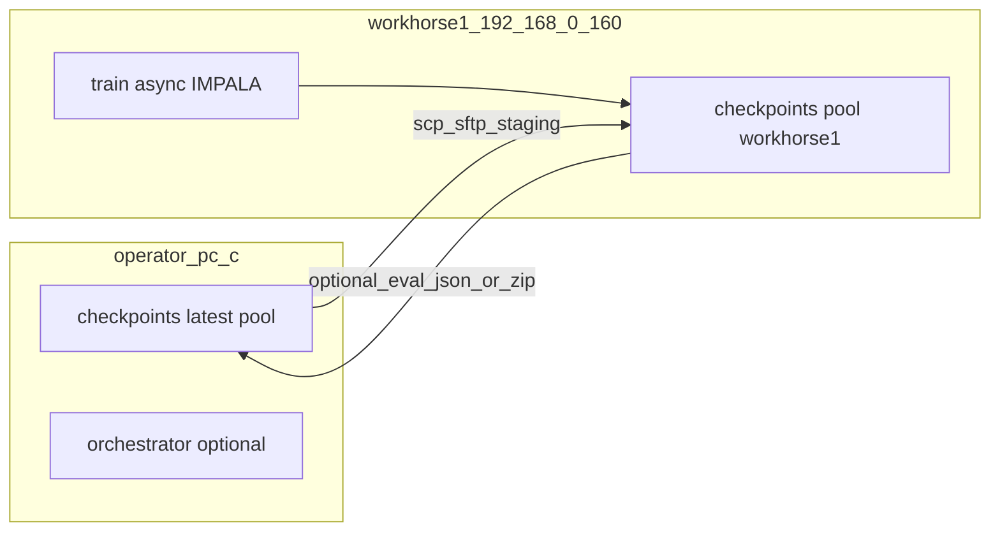

# workhorse1 (192.168.0.160) – eternal main, no-Samba, async push

## What "highest stage" means here

There are **two** stage ladders in-repo; people mix the words.

**Strategic roadmap ([MASTERPLAN.md](MASTERPLAN.md) §2–3, §68–86)** — dependency stack, bottom to top:

- **Phase 0** — infrastructure (complete).
- **Phase 1a/1b** — narrow curriculum → distribution expansion.
- **Phase 1 Full** — validation on **Stage 3–4** target map/CO mix (not the tiny Misery-only slice).
- **Phase 2 MCTS (production)** — real strength; requires Phase 1 Full + turn-level sim + EV gate.
- **Phase 3** — Hierarchical / macro (research).

The long-run **"summit"** the doc points to is **Phase 2 (production MCTS) on a broad distribution**, and eventually **ladder-style "superhuman"** Standard play (MASTERPLAN §8 uses that term for a **deployed** line, not a single training hyperparameter).

**Fleet / ops** ([docs/multi_machine_weight_sync_design.md](docs/multi_machine_weight_sync_design.md) §2, §8–9; [docs/SOLO_TRAINING.md](docs/SOLO_TRAINING.md)) — separate from RL phases:

- **Tier 1** — `start_solo_training` walk-away (probe + `train` + orchestrator on one host).
- **Tier 2** — silent **checkpoint sync** + reload hooks (orchestrator design exists; **rsync/SSH** transport is the intended production path, **not** multi-GB Samba I/O).
- **Tier 3** — round-robin audits, leader manifests, dashboard polish.

**One-line answer for the imperator:** the **highest *strategic* stage** in MASTERPLAN is **Phase 3** in principle; the **highest *practical* milestone** the stack is built to reach is **Phase 1 Full → Phase 2 MCTS (production strength)**. The **highest *ops* "tier"** for multi-PC is **Tier 2** (silent, SSH-backed weight diffusion).

---

## Why Samba is out for your new doctrine

[docs/multi_machine_weight_sync_design.md](docs/multi_machine_weight_sync_design.md) already rejects bulk checkpoint traffic on SMB (latency, partial-write visibility) and recommends **rsync/SSH** with staging + `sha256` + `os.replace`, with **hub via the operator PC** (two hops) when direct leader→laggard keys are awkward.

[.cursor/skills/awbw-auxiliary-main-machines/SKILL.md](.cursor/skills/awbw-auxiliary-main-machines/SKILL.md) still documents **D:/awbw** on Main and a **Samba** mount for aux—treat that as **legacy** for large zips. **Code and small JSON** can still move by `git` over the network; **checkpoints and heavy logs** should move by **SCP/SFTP or rsync over SSH** (WSL or cwRsync on Windows).

---

## Target architecture: workhorse1 = canonical main, pc-b = ahead line

| Concern | Direction |
|--------|------------|
| **Truth for "latest policy"** | **This machine** (`D:\AWBW`) is ahead — **one-time seed** + periodic push to workhorse1. |
| **workhorse1 role** | Treat as [`fleet_env.load_machine_role`](rl/fleet_env.py) `main`: repo on disk (historically **`D:\awbw`**) — **no** `AWBW_SHARED_ROOT` for training unless it equals the repo (same file as skill's sanity check for main). |
| **Machine id** | Use a dedicated id, e.g. `--machine-id workhorse1`, so [`fleet/workhorse1/`](fleet/workhorse1/) (probe, `status.json`, `proposed_args.json`, `eval/`, `pool/`) is isolated from `pc-b`. |
| **Orchestrator** | [scripts/fleet_orchestrator.py](scripts/fleet_orchestrator.py) takes a **single** `--shared-root` and multiple `--pools` under that tree. Without a shared filesystem, a **unified** two-pool tick only works if you **rsync/scp the whole `fleet/<id>/` + relevant `checkpoints/pool/<id>`** into one place **or** run **one orchestrator per host** (simpler). **Recommendation for Phase 1 of bring-up:** run **standalone** stack on workhorse1 (`--pools workhorse1` only); keep **pc-b**'s existing orchestration as the operator hub for promotion/eval. Add **scripted** zip + manifest exchange between hosts before merging orchestrator views. |

---

## On-box bring-up (after plan approval; requires SSH to 192.168.0.160)

1. **Inventory** (read-only first): OpenSSH, Python/venv, CUDA driver, `nvidia-smi`, free disk, existing **`D:\awbw`**, and whether a stale **`checkpoints\latest.zip`**, `checkpoints\pool\**`, and `logs\**` predate the current encoder/policy contract (MASTERPLAN §1: old zips are not loadable without transplant).
2. **Git parity:** `git fetch` / `git pull` to **the same commit** as `D:\AWBW` (or merge/rebase as you prefer). No Samba: **git remote over SSH/HTTPS** from workhorse1.
3. **Clean stale training artifacts (destructive, operator-approved):** Archive or delete old **`checkpoints\checkpoint_*.zip`**, suspicious **`checkpoints\latest.zip`**, oversized **`logs\*.jsonl`**, and optionally reset **`fleet\**\**` for the old machine id so `workhorse1` starts fresh—**then** copy a **known-good** `latest.zip` (and any pool opponent zips you need) **from this PC** via `scp`/`sftp` (push from here or pull on workhorse1).
4. **Venv** — match **torch + CUDA** stack to the repo's `requirements.txt` / what pc-b uses; run **`python scripts/rebuild_cython_extensions.py`** (Windows path from [start_solo_training.py](scripts/start_solo_training.py) docstring) so engine extensions match.
5. **Probe + bootstrap:** `python tools/probe_machine_caps.py --machine-id workhorse1` then `python scripts/start_solo_training.py --machine-id workhorse1 --auto-apply --training-backend async` plus whatever **extra args** you use on pc-b for **hybrid GPU opponents** and env count (the bootstrap already documents **`--train-extra-args`** and **`--no-hybrid-gpu-cpu-opponents`**; hybrid defaults help "as many GPU opponent slots as the semaphore allows, rest CPU" — see docstring around hybrid env vars in [scripts/start_solo_training.py](scripts/start_solo_training.py) and [rl/async_impala.py](rl/async_impala.py) for `AWBW_ASYNC_GPU_OPPONENTS`).

**Async "push hard":** `--training-backend async` selects IMPALA ([train.py](train.py) `--training-backend`); tune `--async-unroll-length`, `--async-learner-batch`, `--n-envs` (actor count) after `probe` + a short `fps-diag` slice—mirroring how you proved throughput on this machine. Optional: **torch.compile** if MSVC + Triton are acceptable ([docs/SOLO_TRAINING.md](docs/SOLO_TRAINING.md)).

---

## Ongoing help without Samba: hub sync pattern (this PC ↔ workhorse1)

- **Policy weights:** **Push** `checkpoints\latest.zip` and selected `checkpoints\pool\workhorse1\` or `checkpoint_*.zip` from **ahead (pc-b)** to workhorse1 when seeding; **pull** or push **periodically** for two-way pool diversity (use **Option B** in the design doc: **operator PC as hub** if direct host-to-host is finicky).
- **Integrity:** add or verify **`.sha256` sidecar** (design §6) before relying on a copied `latest.zip`; never load partial transfers.
- **Reload:** [`fleet/<id>/reload_request.json`](rl/self_play.py) + Phase 10d still apply — point `target_zip` at a **local** path on workhorse1 after the file lands.
- **Orchestrator / promotion:** If you want workhorse1's `latest` to **compete in symmetric eval** with pc-b, copy zips (or `fleet/workhorse1/eval/*.json`) to **this** tree **or** run `scripts/symmetric_checkpoint_eval.py` on either host with **explicit** paths—no need for a shared `Z:`.

---

## Optional follow-ups (not required for first useful contribution)

- **Implement or script** a small `tools/fleet_scp_sync.py` (or PowerShell) that automates the design doc's **staging + hash + os.replace** pattern—[scripts/fleet_orchestrator.py](scripts/fleet_orchestrator.py) has **no** `rsync`/`ssh` today (grep is empty); Tier-2 "silent" remains partially manual.
- **Update** [.cursor/skills/awbw-auxiliary-main-machines/SKILL.md](.cursor/skills/awbw-auxiliary-main-machines/SKILL.md) to name **workhorse1**, mark Samba as **metadata/small files only**, and point to SSH for zips.
- **Rename mental model:** "Main" in docs = **this host**; Samba = optional, not the spine.

---

## Risk / counsel

- **Two writers to one `checkpoints\latest.zip`:** if both train into the same path **without** atomic discipline, you **will** get races. Safer: **separate** `checkpoints\pool\pc-b\` vs `checkpoints\pool\workhorse1\` and promote with evals—[`rl/fleet_env.py`](rl/fleet_env.py)'s pool layout already supports this pattern.
- **Schema drift:** if workhorse1 runs an **older** `game_log` / encoder, orchestrator and MCTS health tools will **lie**; **git + zip + sha256** must move together.
- **SSH sessions vs interactive GPU mapping (1312 on aux):** skill notes `net use` issues from **non-interactive** OpenSSH; workhorse1 as **the** box where you RDP/Console-map nothing for training if GPU visibility matters—verify `nvidia-smi` in the **same** session that will run `train.py`.

