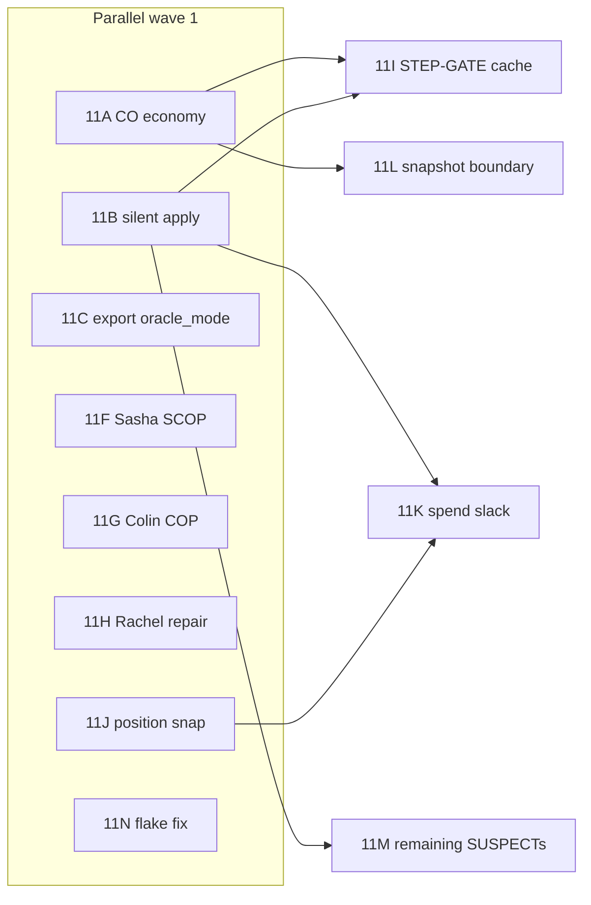

# Phase 11 — Engine state-sync hardening & ergonomic gates

**Subtitle:** Post–Phase-10 charter for treasury / silent-skip / perf / residual cleanup.

**Audit set:** 741 GL std-tier replays (`data/amarriner_gl_std_catalog.json` ∩ on-disk zips).  
**Baseline exiting Phase 10:** `logs/desync_register_post_phase10q.jsonl` — **680 ok / 51 oracle_gap / 10 engine_bug** (seed **1**, per project convention).

**Primary rules source (CO text):** [AWBW CO Chart — `co.php`](https://awbw.amarriner.com/co.php) — use for COP/SCOP names and stated effects unless a lane doc explicitly flags a chart vs live-site discrepancy (e.g. Kindle city-income in `co_data.json` + Phase 10N vs chart silence on D2D income).

---

## Section 1 — Inherited findings (Phase 10 rollup)

Every row below is work Phase 11 must either **ship**, **defer with written rationale**, or **close as wont-fix** against acceptance criteria in Section 4.

| ID | Finding | Phase 11 implication | Source |
|----|---------|----------------------|--------|
| **10N-α** | Incomplete **Kindle** D2D income in `_grant_income` (+50% from owned **cities** per drill + `co_data`; [CO chart](https://awbw.amarriner.com/co.php) emphasizes **urban attack**, not city-income line — document discrepancy) | Implement + reconcile city predicate | `phase10n_funds_drift_recon.md`, `phase10t_co_income_audit.md` |
| **10N-β** | **Spend-side** drift: engine build/repair can no-op while zip advances (1620188-shaped) | Tighten oracle/build path or raise on impossible spend | `phase10n_funds_drift_recon.md` |
| **10N-γ** | **Income vs snapshot boundary**: engine may grant day income before gzip line reflects it (1628609-shaped); needs export semantics | Pairing fix or compare-hook; **C# Replay Player / PHP ground truth** | `phase10n_funds_drift_recon.md` |
| **10O** | **24** SUSPECT silent early `return`s in `engine/game.py` `_apply_*` when `oracle_mode=True` (STEP-GATE off); **top 3:** `_apply_build`, `_apply_join`, `_apply_repair` | Strict oracle / typed raises on masked paths | `phase10o_oracle_mode_silent_return_audit.md` |
| **10O-remainder** | **21** lower-priority SUSPECT branches (24 total − top 3 focus) | Incremental tightening after high-impact lanes | `phase10o_oracle_mode_silent_return_audit.md`, `logs/phase10o_oracle_mode_audit.json` |
| **10T** | **Hachi** build cost: engine **50% on base only** vs chart **90%** D2D | Align `_build_cost` with [CO chart](https://awbw.amarriner.com/co.php) | `phase10t_co_income_audit.md` |
| **10T** | **Sasha** SCOP **War Bonds**: **50% of damage dealt** as funds — not in `_apply_attack` | Implement SCOP treasury hook | `phase10t_co_income_audit.md`, [CO chart](https://awbw.amarriner.com/co.php) |
| **10T** | **Colin** COP **Gold Rush**: multiply **current funds ×1.5** — not found in power path | Implement COP activation | `phase10t_co_income_audit.md`, [CO chart](https://awbw.amarriner.com/co.php) |
| **10T** | **Rachel** **+1 additional repair HP** (liable for costs) — engine uses standard property heal band | Property-day repair branch | `phase10t_co_income_audit.md`, [CO chart](https://awbw.amarriner.com/co.php) |
| **10I** | STEP-GATE duplicate `get_legal_actions`: **~142.7%** mean overhead vs `oracle_mode=True` (**RED** >15%) | Cached-legal / revision invalidation (design first) | `phase10i_step_latency.md`, `logs/phase10i_step_latency.json` |
| **10D** | **15** non–B_COPTER `engine_bug` rows: **14** Bucket A Fire-time board drift; **1** BLACK_BOAT semantic | Shares **11J** / position-snap family with Phase 7–9 narrative | `phase10d_non_b_copter_triage.md` |
| **10R-def** | **182065** trace pair: export calls `step` without `oracle_mode` on paths that hit STEP-GATE | Thread `oracle_mode=True` through export | `phase10r_stale_test_cleanup.md`, `phase10m_pytest_triage.md`, `phase10g_wider_slack_inventory.md` |
| **10R-def** | **`test_picks_nearest_attacker...`** possible order / `unit_id` flake | Determinism / bisect | `phase10r_stale_test_cleanup.md`, `phase10m_pytest_triage.md` |
| **10G** | `export_awbw_replay_actions`: `ValueError` catches **`IllegalActionError`**; broad `continue`/`pass` on BUILD / meta | Narrow exceptions; fail-closed or logged counters | `phase10g_wider_slack_inventory.md` |
| **10G** | `desync_audit` relabels setup `engine_bug` → `loader_error`; batch harness bucket | Taxonomy split (`audit_harness_error`, etc.) | `phase10g_wider_slack_inventory.md` |
| **10F** | **39/50** sampled `ok` rows drift vs PHP snapshots (funds-first) | Economy + silent-skip lanes must shrink this | `phase10f_silent_drift_recon.md` |

---

## Section 2 — Lane proposals

Convention: **Owner** is a suggestion only. **Risk:** LOW / MED / HIGH (replay churn, false positives, or API surface).

| Lane ID | Title | Owner suggestion | Files touched (typical) | Acceptance criteria | Risk | Source recon doc |
|---------|--------|------------------|-------------------------|---------------------|------|------------------|
| **11A** | Kindle + Hachi engine income/cost canon | Opus (engine rules) | `engine/game.py` (`_grant_income`), `engine/action.py` (`_build_cost`), `engine/terrain.py` / property predicates | Kindle city-income matches 10N drill + unit tests; Hachi **90%** build matches [CO chart](https://awbw.amarriner.com/co.php); targeted replays / audit sample improve | MED | `phase10n_funds_drift_recon.md`, `phase10t_co_income_audit.md` |
| **11B** | `_apply_*` silent return tightening (build / join / repair) | Composer 2 | `engine/game.py` | Top-3 10O branches either raise under documented oracle-strict flag or are proven JUSTIFIED with tests; no new silent fund skips on golden zips | HIGH | `phase10o_oracle_mode_silent_return_audit.md` |
| **11C** | Trace **182065** export `oracle_mode` threading | Composer 2 | `tools/export_awbw_replay_actions.py`, tests under `tests/test_trace_182065_seam_validation.py` | Both deferred trace tests **pass**; `IllegalActionError` not swallowed by `ValueError` handler (align **10G D1**) | MED | `phase10m_pytest_triage.md`, `phase10r_stale_test_cleanup.md`, `phase10g_wider_slack_inventory.md` |
| **11F** | Sasha SCOP **War Bonds** — damage → funds | Opus | `engine/game.py` (`_apply_attack` or combat treasury hook), CO power state | SCOP active: funds += **50%** of damage dealt per [CO chart](https://awbw.amarriner.com/co.php); regression test | MED | `phase10t_co_income_audit.md` |
| **11G** | Colin COP **Gold Rush** — funds × **1.5** | Opus | `engine/game.py` (`_apply_power_effects` / COP path) | On COP activation, funds multiply as chart; order vs AWBW verified on minimal replay | MED | `phase10t_co_income_audit.md`, [CO chart](https://awbw.amarriner.com/co.php) |
| **11H** | Rachel **+1 repair HP** | Composer 2 | `engine/game.py` (`_resupply_on_properties` or equivalent) | Property-day heal matches chart **+1** extra HP with correct cost; **1632355**-class drift addressed | LOW | `phase10t_co_income_audit.md`, [CO chart](https://awbw.amarriner.com/co.php) |
| **11I** | STEP-GATE perf cache (**10I RED** ~142% overhead) | Opus (design) → Composer 2 (impl) | `engine/game.py`, possibly `engine/action.py` | Mean incremental STEP-GATE overhead **&lt; 30%** on `tools/_phase10i_step_benchmark.py` workload; neg-tests + property-equivalence still green | HIGH | `phase10i_step_latency.md` |
| **11J** | Oracle position-snap extension (Bucket A residuals) | Composer 2 | `tools/oracle_zip_replay.py`, tests | Reduces **oracle_gap** Move-truncate family without reopening Manhattan; **10D** Class E rows trend toward `ok` or documented `engine_bug` | HIGH | `phase7_drift_triage.md` (Bucket A), `phase10d_non_b_copter_triage.md`, `phase10c_move_truncate_subshape_classification.md` |
| **11K** | Move/Build slack reconciliation (spend-side drift) | Composer 2 | `tools/oracle_zip_replay.py`, `engine/game.py` | Build/repair envelopes that AWBW recorded cannot silently no-op in audit mode when funds/occupancy disagree | HIGH | `phase10n_funds_drift_recon.md` |
| **11L** | Income / snapshot boundary timing | Opus + external ground truth | `tools/replay_state_diff.py`, possibly `engine/game.py` `_end_turn` ordering | Documented rule for “funds in line L”; **1628609**-class mismatches resolved or explicitly excluded with cite | HIGH | `phase10n_funds_drift_recon.md` |
| **11M** | Remaining **21** SUSPECT `_apply_*` tightenings | Composer 2 | `engine/game.py` | Each branch: raise, justify, or test-locked no-op; cross-ref `logs/phase10o_oracle_mode_audit.json` | MED | `phase10o_oracle_mode_silent_return_audit.md` |
| **11N** | `test_picks_nearest_attacker_to_zip_anchor_when_ambiguous` flake fix | Composer 2 | `tests/test_oracle_zip_replay.py`, possibly engine ID allocation in fixtures | Full-suite **stable pass**; tie-break `(distance, row, col, unit_id)` documented vs test | LOW | `phase10r_stale_test_cleanup.md` (#9), `phase10m_pytest_triage.md` |

**Status note (time of charter write):** Lanes **11A**, **11B**, and **11C** are recorded as **IN PROGRESS** in campaign orchestration — keep charter acceptance criteria as the merge bar regardless of parallel start order.

---

## Section 3 — Sequencing

**Text summary**

- **Parallel now:** **11A**, **11B**, **11C**, **11F**, **11G**, **11H**, **11J**, **11N** — independent workstreams with different files; only watch for merge conflicts in `engine/game.py`.
- **After stabilization:** **11I** depends on **11A** + **11B** not thrashing treasury/apply semantics (per campaign brief: stable canon before perf caching).
- **11K** depends on **11B** (build/join/repair behavior defined before spend-side reconciliation).
- **11L** can start in parallel with **11A** but often **finishes last** (needs definitive snapshot semantics).
- **11M** follows **11B** or runs as a mop-up once top branches are classified.

---

## Section 4 — Acceptance criteria for Phase 11 closure

All must be true to close Phase 11 as a phase (individual lanes may still be formally **DEFERRED** with a one-line entry in this file):

1. **`engine_bug` &lt; 5** on full **741**-game `desync_audit` register (seed **1**).
2. **Funds drift** in the Phase **10F** methodology: **&lt; 10 / 50** sampled `ok` rows showing first funds mismatch vs PHP (baseline **39 / 50**).
3. **STEP-GATE overhead &lt; 30%** on the Phase **10I** benchmark harness (mean incremental cost vs `oracle_mode=True`).
4. **Full pytest 0 failures** (no deferred failures without an explicit DEFER row).
5. **All Phase 11 lanes** in Section 2 marked **SHIPPED** or **DEFERRED** with owner + date.

---

## Section 5 — Out of scope

Phase 11 **will not**:

- Add **new unit types**, **new COs**, or **new game modes**.
- Replace STEP-GATE with mask-only trust for RL/production callers (perf work is **caching / reuse**, not removal of the contract).
- Chase **UI / web viewer** polish or **Figma** work.
- Expand performance work beyond **STEP-GATE / legal enumeration** hot path (no blanket engine micro-optimization charter).
- Re-litigate **Manhattan direct-fire** or **seam allowlist** canon (closed in Phases 6–8).
- Merge oracle widenings that **swallow** real board-state drift (campaign rule carries forward).

---

## Citation index (CO / economy)

| Rule | Primary URL |
|------|-------------|
| CO powers & D2D lines (chart-first) | https://awbw.amarriner.com/co.php |
| Weather vs income (if needed) | https://awbw.fandom.com/wiki/Weather |
| Per-CO wiki (secondary) | https://awbw.fandom.com/wiki/Category:Commanding_Officers |

---

*End of Phase 11 charter.*
